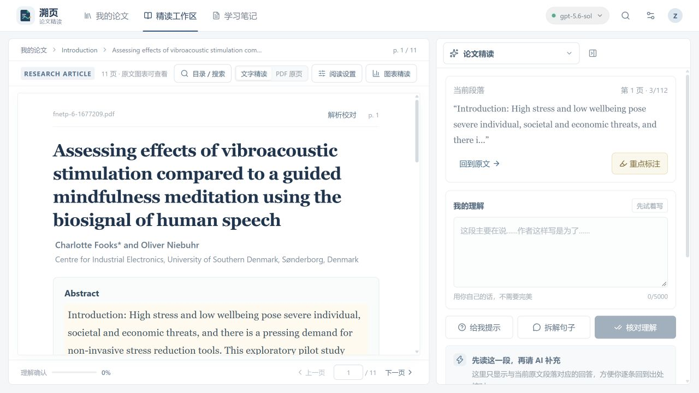
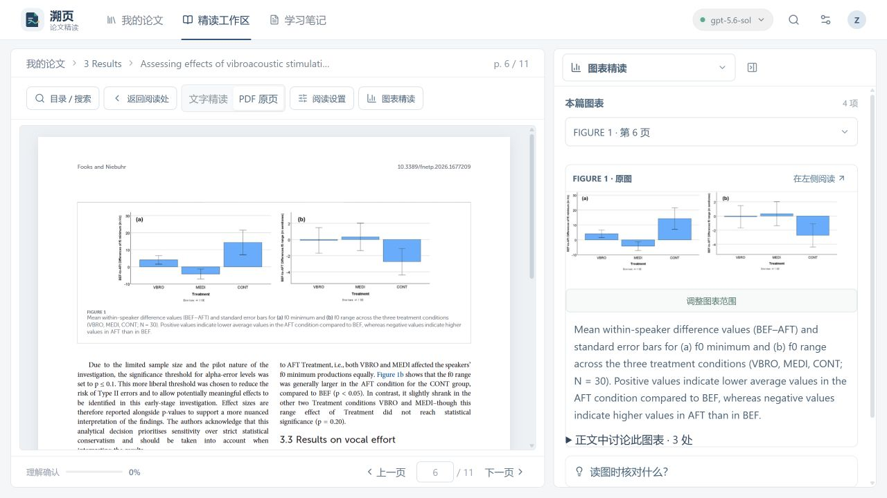

# 溯页 · 论文精读

**溯页**是一款以英文论文原文为中心的学习工具。它把论文阅读、AI 引导、图表核对和学习笔记放在同一工作区，帮助读者先形成自己的理解，再借助解释回到原文与页码核对证据。

> 原产品代号：PaperBridge。应用界面使用“溯页”作为产品名称。

## 功能概览

- **文献库**：导入 PDF、搜索论文、按主题分组、移动或删除文献。
- **原文精读**：并排阅读论文原文和学习助手；支持文本视图与 PDF 原页视图、页码导航及阅读字体设置。
- **引导式学习**：围绕研究背景、研究问题、方法、发现等阶段学习；可先写自己的理解，再请 AI 提示、拆解句子或核对理解。
- **通用 AI 对话**：在助手中连续追问一般问题；对话历史保存在本地数据中，可搜索、继续查看或删除。需要论文帮助时，可主动关联当前文献；系统检索相关原文片段，要求 AI 区分作者结论与解释并注明页码。
- **AI 段落翻译**：翻译当前选中的论文段落，可选简体中文、繁體中文、英语或日语；翻译时参考论文标题、相邻原文和该文献术语卡，只输出所选段落的译文。可复制译文，或将其收藏到当前论文笔记。
- **论文主线**：按研究逻辑梳理全文，并跳转到相应原文位置。
- **图表精读**：定位论文中的图表引用，在原 PDF 中查看图表，并结合正文讨论理解数据。
- **笔记与标注**：按文献保存学习笔记、AI 回答、术语卡和原文重点标注；可在独立笔记页统一检索和回看。
- **可配置 AI**：添加多个兼容服务端点、切换模型，并测试连接。AI 回答保留对应段落和页码，便于回到原文核对。
- **响应式界面**：适配桌面、平板和窄屏阅读场景。
- **数学公式**：AI 回复中的 Markdown 行内公式、块级公式及常见 LaTeX 分隔符均会渲染。

### 本轮改进（2026-10-06）

- 学习、对话、笔记编辑和译文修改保留独立草稿；切换段落或关闭编辑后可以继续，后端暂时不可用时保留本地副本并重试同步。
- 译文编辑自动保存，缓存按论文、页码、解析版本、上下文及供应商配置区分；切换原文时取消翻译请求，匹配原文的旧版人工校对译文继续保留。
- 笔记与术语删除使用统一确认组件；笔记更新直接同步列表，搜索可以按文献标题查找。
- 接口返回网页而非 JSON 时，显示后端地址或代理配置错误；用户数据和凭据文件不进入源码提交。

本轮问题分析、实现方式及检查边界见 [修复记录](docs/repair-review-2026-10-06.md)。

## 界面预览

下面是本次本地改造的实际阅读工作区截图：左侧按标题、作者和正文分层阅读，右侧保留当前段落与学习记录入口。



实际体验修复后的图表工作区：原图优先展示，完整图题与正文讨论入口跟随所选图表。



下图是此前版本的 AI 论文翻译界面。翻译围绕选中的原文段落展开，并提供复制译文和收藏到论文笔记的操作。


## Windows 桌面版

项目可打包为 Windows `.exe` 安装程序。桌面版在本机启动 API 和前端，不需要阿里云服务器；PDF、笔记、标注、对话及供应商设置保存在 Windows 用户数据目录中，数据不放在应用安装目录。

在 Windows 开发环境构建：

```bash
npm ci
python -m pip install -r server/native/requirements.txt
npm run desktop:build
```

安装包输出到 `release/`。开发者也可以运行 `npm run desktop:dir` 生成未封装目录，以排查启动问题。应用数据位于 Electron 的 `userData/data` 目录（Windows 通常在 `%APPDATA%/溯页/data`）；备份时先退出应用，再复制该目录。桌面端在系统支持时使用 Electron safeStorage 保护本机加密密钥，再以 AES-256-GCM 保存供应商 API Key。备份需包含整个数据目录及 `storage-key.bin`，凭据通常只能在原 Windows 用户环境解锁。旧 JSON 备份与未设置存储密钥的网页版仍可能含明文凭据，请勿上传用户数据。首版桌面构建尚未配置代码签名，Windows 可能显示下载或运行提示。

## 本地运行

需要 Node.js 24.11 或更高版本（使用内置 SQLite）。普通文本型 PDF 可直接运行；增强本地解析需 Python 3.12+ 和 `pymupdf`。

```bash
npm install
npm run dev
```

打开终端中 Vite 输出的本地地址（通常为 `http://127.0.0.1:5173`）。开发 API 默认监听 `http://127.0.0.1:8787`，仅绑定本机回环地址。

生产构建与启动（PowerShell）：

```bash
npm run build
$env:NODE_ENV="production"
npm start
```

## 部署

本项目将静态前端发布到 GitHub Pages；API、上传的 PDF、笔记和 AI 服务配置运行在自己的阿里云 ECS 上。**首次部署需准备一个解析到 ECS 的域名**（例如 `api.example.com`），让 Caddy 自动申请 HTTPS 证书。GitHub Pages 的默认前端地址为 `https://jimmyzhang06.github.io/paperbridge/`。

### 发布前端到 GitHub Pages

1. 在仓库 **Settings → Pages → Build and deployment** 中将 Source 设为 **GitHub Actions**。
2. 在 **Settings → Secrets and variables → Actions → Variables** 新建变量 `VITE_API_BASE_URL`，值填 API 的 HTTPS 起源，例如 `https://api.example.com`（不要加路径或末尾斜杠）。
3. 将代码合并到 `main`，或在 Actions 页面手动运行 **Deploy frontend to GitHub Pages**。工作流会构建并发布 `dist/`。

### 在阿里云 ECS 运行 API

1. 准备安装 Docker Engine 和 Docker Compose 插件的 Linux ECS，并将 API 域名的 DNS A 记录指向服务器公网 IP。
2. 把仓库源码放到服务器，复制 `.env.example` 为 `.env`，填入 `API_DOMAIN`，并将 `CORS_ORIGINS` 保持为前端站点 Origin：`https://jimmyzhang06.github.io`。
3. 在阿里云安全组中开放 TCP 80 和 443 供 Caddy 完成 HTTP 跳转及 TLS 证书校验。此版本尚未实现账号认证；**不要把 API 的 443 端口向全网开放**。个人使用时将 443 入站来源限制为你自己的固定公网 IP `/32`，SSH（22）也仅允许可信管理 IP。否则，知道 API 地址的人可能读写文献、笔记和供应商配置。
4. 在服务器执行：

   ```bash
   cp .env.example .env
   # 编辑 .env，填入 API_DOMAIN
   docker compose up --build -d
   docker compose logs -f api caddy
   ```

5. 确认 `https://<API_DOMAIN>/api/health` 可访问且返回服务状态，再设置 Pages 变量并运行前端发布工作流。

ECS 上的 `data/` 通过 Compose 卷挂载到主机，容器重建不会清除文献数据。不要把服务器 `.env` 或 `data/` 提交到 Git。若要开放给多人或公网用户使用，应先实现账号认证、用户数据隔离和安全的 API Key 加密存储，再移除 IP 限制。

GitHub Pages 工作流文件位于 `.github/workflows/deploy-pages.yml`；ECS 部署配置为 `Dockerfile`、`compose.yaml` 和 `Caddyfile`。后端仅在容器网络中暴露 8787，由 Caddy 提供 HTTPS 入口。

## 配置 AI 服务

在应用的服务设置中添加供应商名称、兼容接口地址、模型名称和 API Key，然后测试并启用供应商。接口需兼容项目支持的 OpenAI API 格式；可在设置中配置多个服务并切换。没有启用服务时，应用仍可使用文献库、PDF 阅读和笔记功能；助手会明确显示演示模式回复。

服务适配器位于 `server/providers.ts`。新增供应商时，实现 `AIProvider` 接口并在 `createProvider()` 中注册，通常无需改动阅读界面和学习流程。

## 学习建议

1. 导入可提取文本的 PDF，在文献库中按主题分组。
2. 先阅读英文原文，再选择段落并用自己的话写下理解。
3. 根据需要请求提示、长句拆解、术语解释或理解核对。
4. 对照 AI 回答中的页码回到原文，检查解释是否有证据支持。
5. 修订自己的理解，收藏有用的 AI 回答、术语或重点段落。
6. 在论文主线和图表精读中串联研究逻辑；之后按论文回顾笔记与不确定之处。

AI 内容是学习辅助，特别是统计结果、方法细节和因果表述，应以论文原文和数据为准。导入通过后台任务执行；优先使用本机 PyMuPDF 读取字体、文字几何与图片/矢量范围，不可用时回退 PDF.js。PDF.js 按页读取文字层和坐标，再按版面重建行、段落与双栏阅读顺序；会尝试排除重复页眉页脚与旋转的页边水印，并为每页记录提取字符数、文字块数量和质量提示。阅读页会突出识别到的章节标题、图表题注，并保留 PDF 文字层提供的粗体、斜体和上下标线索。对于题注附近有足够空白的图表，会在题注旁以内嵌原页裁切预览显示；图表精读栏仍提供完整原页预览。预览由原 PDF 页面直接渲染，因此位图、矢量图、表格线和图例均可显示；布局过于紧密、无法可靠定位时不生成猜测裁切，可切换到完整 PDF 原页核对。标题优先根据首页可见的大字号标题识别，并与 PDF 元数据交叉检查；作者、单位和 DOI 尽量按原页区分。原始 PDF 始终保留，文本视图中的可疑页会提示切回 PDF 原页核对。读者也可在文字精读页点击“解析校对”，本地修正标题、作者和当前页文本块，或隐藏误识别内容；这些修正会影响精读视图与 AI 检索，不修改原始 PDF，也不删除笔记。增强解析器对低文字量页面尝试本地英文 OCR，需要自行安装 Tesseract 英文语言数据，并设置 `TESSDATA_PREFIX`。缺少语言数据时明确提示，仍可阅读原始 PDF；安装包目前不包含 OCR 语言模型。提取文本用于定位和辅助学习，不能替代对原 PDF 的核对。

## API 概览

### 文献与分组

| 方法与路径 | 说明 |
| --- | --- |
| `GET /api/health` | 服务状态 |
| `GET /api/groups` | 获取分组及文献数量 |
| `POST /api/groups` | 新建分组 |
| `PATCH /api/groups/:id` | 重命名分组 |
| `DELETE /api/groups/:id` | 删除分组，文献移至未分组 |
| `GET /api/papers` | 获取文献列表 |
| `POST /api/papers` | 上传并解析 PDF（`multipart/form-data`，字段 `file`，最大 35 MB） |
| `GET /api/papers/:id` | 获取论文页面及段落 |
| `PATCH /api/papers/:id/corrections` | 保存标题、作者及当前页文本块校对 |
| `GET /api/papers/:id/file` | 获取原始 PDF |
| `PATCH /api/papers/:id/group` | 移动文献或设为未分组 |
| `DELETE /api/papers/:id` | 删除文献及关联学习数据 |

### 学习数据与 AI

| 方法与路径 | 说明 |
| --- | --- |
| `GET /api/notes` | 获取跨文献笔记 |
| `GET /api/papers/:id/learning` | 获取论文笔记和最近助手对话 |
| `POST /api/papers/:id/notes` | 创建或更新理解笔记、AI 收藏或重点标注 |
| `DELETE /api/notes/:id` | 删除笔记 |
| `GET /api/terms` | 获取术语卡 |
| `GET /api/papers/:id/terms` | 获取论文术语卡 |
| `POST /api/papers/:id/terms` | 保存术语卡 |
| `DELETE /api/terms/:id` | 删除术语卡 |
| `GET /api/assistant/conversations` | 获取通用对话历史列表 |
| `POST /api/assistant/conversations` | 创建一条通用对话 |
| `GET /api/assistant/conversations/:id` | 获取对话及消息 |
| `DELETE /api/assistant/conversations/:id` | 删除一条通用对话 |
| `GET /api/providers` | 获取供应商列表（API Key 脱敏） |
| `POST /api/providers` | 添加或更新供应商 |
| `PUT /api/providers/active` | 选择当前供应商，或设为 `null` 使用演示模式 |
| `DELETE /api/providers/:id` | 删除供应商 |
| `POST /api/providers/:id/test` | 测试供应商连接 |
| `POST /api/assistant/turn` | 基于选定论文段落和页码请求学习助手 |
| `POST /api/assistant/chat` | 发送连续对话消息到当前启用的 AI 供应商 |
| `POST /api/assistant/translate` | 校验论文段落及页码后翻译到指定语言 |

助手请求包含 `paperId`、`page`、`passage`、`learnerAttempt` 和 `action`。`action` 可为 `hint`、`explain` 或 `check`。服务端会先验证段落确实来自对应论文页面，再将其发送给已配置的 AI 服务。

通用对话通过 `POST /api/assistant/chat` 发送 `{ conversationId, content }`。需要结合全文时附加 `{ paperId }`；服务端会在该论文所有已解析页面中检索相关段落，并将出处页码交给模型，回答应引用页码。历史记录会标记为“结合全文”。消息按会话保存在本地数据中；模型按字符预算收到最近最多 30 条消息。全文检索结合 SQLite FTS5、章节及问题类型，最多选择 28 处出处，总证据预算 42,000 字符；长文不会一次性全部发送给模型。源编号经服务端核对，可跳回原文；这不意味着模型的每条解释都已自动证实。翻译接口会从已验证的论文页提取选中段落前后的原文片段，并附上该文献已保存的术语卡作为语境，不要求浏览器传入可信的额外上下文。

## 数据与限制

- 文献、分组、笔记、对话和设置保存于 `data/library.sqlite`，PDF 位于 `data/uploads/`。数据库使用 WAL 与事务，并合并并发操作中的独立改动；同一字段发生冲突时返回 409。
- 首次运行自动迁移 `data/store.json`，保留 `store.json.before-sqlite-*.bak` 并核对记录数量。读取失败会停止迁移。旧 JSON 与备份不再作为日常写入位置，但可能含明文 API Key。
- 退出网页版本地 API 或桌面应用后，备份整个数据目录；应用运行中仅复制 `.sqlite` 可能遗漏 WAL 中的数据。桌面备份保留 `storage-key.bin`。
- 正文与对话草稿立即写入设备存储，再延迟同步 API；每篇论文保存页码、阅读模式、选中文本及工具状态。同一设备上的浏览器草稿与桌面草稿分别保存。
- 网页版默认本机回环监听；AI 请求只发送给配置的端点。解析不调用云服务。设置 `PAPERBRIDGE_STORAGE_KEY` 为 64 位十六进制值可启用网页版凭据加密，之后必须保留同一密钥才能解锁。
- 图表范围可手动校正；重新解析生成独立版本，并尽量匹配已有校对和出处。无法匹配的校对会提示，旧解析版本保留在数据库中。原始 PDF 不被修改。
- 不保证所有出版社版式、复杂表格、公式、脚注与扫描件都能准确重建。原页是核对入口。当前没有 Docling 模型、向量嵌入、多用户账号或云同步。
- 论文主线的初始出处来自章节与关键词线索；完成阶段需要读者主动确认，不根据点击次数或 AI 回答自动计算。
- 原项目代码遵循仓库 LICENSE；可选 PyMuPDF/MuPDF 组件有独立 AGPL/商业许可证。个人非商业用途不自动改变其许可条件。见 [第三方组件说明](THIRD_PARTY_NOTICES.md)。

## 本次本地改造

本轮实际体验发现的问题、修复与检查边界见 [使用检查记录](docs/usability-review.md)。

PDF 原页增加可选文字层、目录/全文搜索入口、缩放、旋转、原文高亮与一套页码导航。对话支持增量回答、停止生成、内容搜索、出处跳转和收藏。译文结合章节、相邻段落及相关术语，按解析版本与供应商缓存并可修改。笔记默认折叠，支持编辑、标签、分文献导出 Markdown。

增强解析环境：

```bash
python -m pip install -r server/native/requirements.txt
```

当前机器已安装 PyMuPDF；OCR 语言数据需要另行配置。可指定 `PAPERBRIDGE_PYTHON` 或 `PAPERBRIDGE_PARSER_BINARY`，桌面打包会把解析器作为独立本地程序带入。详细数据契约、模块边界和后续选项见 [架构说明](docs/architecture.md)。

本次构建使用 Electron 40.10.6。更新到 41 系列的官方二进制下载未成功，因此尚未完成运行时升级；开发依赖审计中的 Electron 提示仍需后续处理。桌面窗口限制外部导航与新窗口，网页链接由系统浏览器打开。当前配置的 AI 网关返回停用提示，正常 AI 回答、流式生成及翻译尚未完成真实供应商联调，需要更新端点配置后再核验。

### 新增 API

| 方法与路径 | 说明 |
| --- | --- |
| `POST /api/papers` + 表单 `async=true` | 返回 202 后台解析任务 |
| `GET /api/jobs/:id` | 解析进度、完成状态或失败原因 |
| `POST /api/papers/:id/reparse` | 显式重新解析并保留版本 |
| `GET/PUT /api/workspace/:paperId` | 每篇论文的阅读会话 |
| `GET/PUT /api/drafts/:key` | 带时间版本的草稿同步 |
| `PATCH /api/papers/:id/study` | 主动确认学习阶段 |
| `PATCH /api/papers/:id/figures/:blockId` | 修正图表原页裁切范围 |
| `PATCH /api/notes/:id` | 编辑笔记与标签 |
| `GET /api/papers/:id/export` | 导出学习记录、AI 收藏、标注与术语 |
| `POST /api/assistant/chat` + `stream:true` | NDJSON 增量输出，可中断 |
| `POST /api/assistant/conversations/:id/messages/:messageId/note` | 收藏回答到关联文献 |
| `PUT /api/assistant/translations/:key` | 修改缓存译文，保留最初译文 |

## 项目结构

```text
src/
  components/          通用界面组件与品牌标志
  features/assistant/  学习助手样式
  features/notes/      笔记和术语卡
  features/reader/     图表精读与文献阅读
  features/study/      论文主线与学习阶段
  main.tsx             应用入口和工作区编排
server/
  index.ts             HTTP API 与应用启动
  pdfExtraction.ts     本地 PDF 文字层、版面、段落与质量解析
  providers.ts         可插拔 AI 服务协议与流式适配器
  prompts.ts           与供应商独立的学习/对话/翻译提示
  retrieval.ts         全文检索、章节分配与来源证据
  sources.ts           原文锚点及原始 PDF 校验
  jobs.ts              后台解析队列与进度持久化
  extractionWorker.ts  隔离解析任务与本地引擎调用
  native/              PyMuPDF 本地解析程序
  assistantRoutes.ts   对话、取消、译文缓存
  workspaceRoutes.ts   会话、草稿、标注及导出
  store.ts             SQLite、事务、迁移、全文索引
  types.ts             服务端数据类型
public/                静态资源，包括 SVG 品牌图标
```
