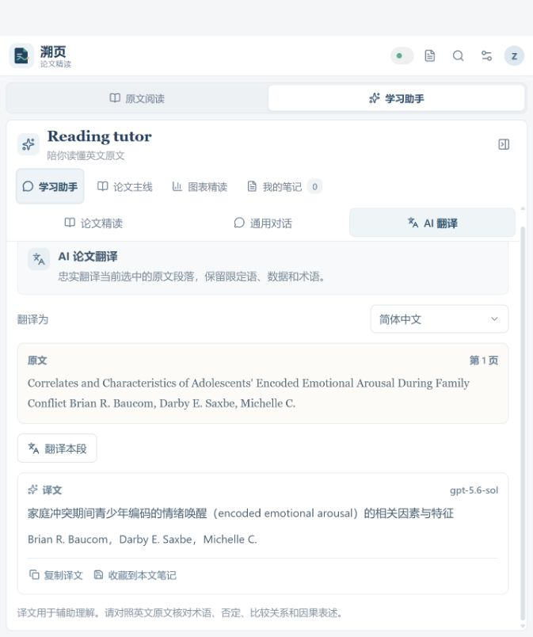

# 溯页 · 论文精读

**溯页**是一款以英文论文原文为中心的学习工具。它把论文阅读、AI 引导、图表核对和学习笔记放在同一工作区，帮助读者先形成自己的理解，再借助解释回到原文与页码核对证据。

> 原产品代号：PaperBridge。应用界面使用“溯页”作为产品名称。

## 功能概览

- **文献库**：导入 PDF、搜索论文、按主题分组、移动或删除文献。
- **原文精读**：并排阅读论文原文和学习助手；支持文本视图与 PDF 原页视图、页码导航及阅读字体设置。
- **引导式学习**：围绕研究背景、研究问题、方法、发现等阶段学习；可先写自己的理解，再请 AI 提示、拆解句子或核对理解。
- **通用 AI 对话**：在助手中连续追问一般问题；对话默认仅保留在当前应用会话，不会自动附加论文内容或保存到服务器。
- **AI 段落翻译**：翻译当前选中的论文段落，可选简体中文、繁體中文、英语或日语；可复制译文，或将其收藏到当前论文笔记。
- **论文主线**：按研究逻辑梳理全文，并跳转到相应原文位置。
- **图表精读**：定位论文中的图表引用，在原 PDF 中查看图表，并结合正文讨论理解数据。
- **笔记与标注**：按文献保存学习笔记、AI 回答、术语卡和原文重点标注；可在独立笔记页统一检索和回看。
- **可配置 AI**：添加多个兼容服务端点、切换模型，并测试连接。AI 回答保留对应段落和页码，便于回到原文核对。
- **响应式界面**：适配桌面、平板和窄屏阅读场景。

## 界面预览

下面是应用当前版本的实际页面截图，展示学习助手中的 AI 论文翻译界面。翻译围绕选中的原文段落展开，并提供复制译文和收藏到论文笔记的操作。



## 本地运行

需要 Node.js 20 或更高版本。

```bash
npm install
npm run dev
```

打开终端中 Vite 输出的本地地址（通常为 `http://127.0.0.1:5173`）。开发 API 默认监听 `http://127.0.0.1:8787`，仅绑定本机回环地址。

生产构建与启动：

```bash
npm run build
npm start
```

## 部署

本项目将静态前端发布到 GitHub Pages；API、上传的 PDF、笔记和 AI 服务配置运行在自己的阿里云 ECS 上。**首次部署需准备一个解析到 ECS 的域名**（例如 `api.example.com`），让 Caddy 自动申请 HTTPS 证书。GitHub Pages 的默认前端地址为 `https://jimmyzhang06.github.io/paperbridge/`。

### 发布前端到 GitHub Pages

1. 在仓库 **Settings → Pages → Build and deployment** 中将 Source 设为 **GitHub Actions**。
2. 在 **Settings → Secrets and variables → Actions → Variables** 新建变量 `VITE_API_BASE_URL`，值填 API 的 HTTPS 起源，例如 `https://api.example.com`（不要加路径或末尾斜杠）。
3. 将代码合并到 `main`，或在 Actions 页面手动运行 **Deploy frontend to GitHub Pages**。工作流会构建并发布 `dist/`。

### 在阿里云 ECS 运行 API

1. 准备安装 Docker Engine 和 Docker Compose 插件的 Linux ECS，并将 API 域名的 DNS A 记录指向服务器公网 IP。
2. 把仓库源码放到服务器，复制 `.env.example` 为 `.env`，填入 `API_DOMAIN`，并将 `CORS_ORIGINS` 保持为前端站点 Origin：`https://jimmyzhang06.github.io`。
3. 在阿里云安全组中开放 TCP 80 和 443 供 Caddy 完成 HTTP 跳转及 TLS 证书校验。此版本尚未实现账号认证；**不要把 API 的 443 端口向全网开放**。个人使用时将 443 入站来源限制为你自己的固定公网 IP `/32`，SSH（22）也仅允许可信管理 IP。否则，知道 API 地址的人可能读写文献、笔记和供应商配置。
4. 在服务器执行：

   ```bash
   cp .env.example .env
   # 编辑 .env，填入 API_DOMAIN
   docker compose up --build -d
   docker compose logs -f api caddy
   ```

5. 确认 `https://<API_DOMAIN>/api/health` 可访问且返回服务状态，再设置 Pages 变量并运行前端发布工作流。

ECS 上的 `data/` 通过 Compose 卷挂载到主机，容器重建不会清除文献数据。不要把服务器 `.env` 或 `data/` 提交到 Git。若要开放给多人或公网用户使用，应先实现账号认证、用户数据隔离和安全的 API Key 加密存储，再移除 IP 限制。

GitHub Pages 工作流文件位于 `.github/workflows/deploy-pages.yml`；ECS 部署配置为 `Dockerfile`、`compose.yaml` 和 `Caddyfile`。后端仅在容器网络中暴露 8787，由 Caddy 提供 HTTPS 入口。

## 配置 AI 服务

在应用的服务设置中添加供应商名称、兼容接口地址、模型名称和 API Key，然后测试并启用供应商。接口需兼容项目支持的 OpenAI API 格式；可在设置中配置多个服务并切换。没有启用服务时，应用仍可使用文献库、PDF 阅读和笔记功能；助手会明确显示演示模式回复。

服务适配器位于 `server/providers.ts`。新增供应商时，实现 `AIProvider` 接口并在 `createProvider()` 中注册，通常无需改动阅读界面和学习流程。

## 学习建议

1. 导入可提取文本的 PDF，在文献库中按主题分组。
2. 先阅读英文原文，再选择段落并用自己的话写下理解。
3. 根据需要请求提示、长句拆解、术语解释或理解核对。
4. 对照 AI 回答中的页码回到原文，检查解释是否有证据支持。
5. 修订自己的理解，收藏有用的 AI 回答、术语或重点段落。
6. 在论文主线和图表精读中串联研究逻辑；之后按论文回顾笔记与不确定之处。

AI 内容是学习辅助，特别是统计结果、方法细节和因果表述，应以论文原文和数据为准。扫描版 PDF 需要先进行 OCR 才能使用文本提取与段落学习；PDF 原页视图可查看原始页面布局、图表和公式。

## API 概览

### 文献与分组

| 方法与路径 | 说明 |
| --- | --- |
| `GET /api/health` | 服务状态 |
| `GET /api/groups` | 获取分组及文献数量 |
| `POST /api/groups` | 新建分组 |
| `PATCH /api/groups/:id` | 重命名分组 |
| `DELETE /api/groups/:id` | 删除分组，文献移至未分组 |
| `GET /api/papers` | 获取文献列表 |
| `POST /api/papers` | 上传并解析 PDF（`multipart/form-data`，字段 `file`，最大 35 MB） |
| `GET /api/papers/:id` | 获取论文页面及段落 |
| `GET /api/papers/:id/file` | 获取原始 PDF |
| `PATCH /api/papers/:id/group` | 移动文献或设为未分组 |
| `DELETE /api/papers/:id` | 删除文献及关联学习数据 |

### 学习数据与 AI

| 方法与路径 | 说明 |
| --- | --- |
| `GET /api/notes` | 获取跨文献笔记 |
| `GET /api/papers/:id/learning` | 获取论文笔记和最近助手对话 |
| `POST /api/papers/:id/notes` | 创建或更新理解笔记、AI 收藏或重点标注 |
| `DELETE /api/notes/:id` | 删除笔记 |
| `GET /api/terms` | 获取术语卡 |
| `GET /api/papers/:id/terms` | 获取论文术语卡 |
| `POST /api/papers/:id/terms` | 保存术语卡 |
| `DELETE /api/terms/:id` | 删除术语卡 |
| `GET /api/providers` | 获取供应商列表（API Key 脱敏） |
| `POST /api/providers` | 添加或更新供应商 |
| `PUT /api/providers/active` | 选择当前供应商，或设为 `null` 使用演示模式 |
| `DELETE /api/providers/:id` | 删除供应商 |
| `POST /api/providers/:id/test` | 测试供应商连接 |
| `POST /api/assistant/turn` | 基于选定论文段落和页码请求学习助手 |
| `POST /api/assistant/chat` | 发送连续对话消息到当前启用的 AI 供应商 |
| `POST /api/assistant/translate` | 校验论文段落及页码后翻译到指定语言 |

助手请求包含 `paperId`、`page`、`passage`、`learnerAttempt` 和 `action`。`action` 可为 `hint`、`explain` 或 `check`。服务端会先验证段落确实来自对应论文页面，再将其发送给已配置的 AI 服务。

## 数据与限制

- 学习数据和供应商配置保存在本地 `data/store.json`；上传的 PDF 保存在 `data/uploads/`。这些运行时数据目录已加入 `.gitignore`。
- API Key 当前以未加密形式保存在本机数据文件中。请勿将 `data/`、`.env` 或包含密钥的配置提交到代码仓库，也不要在不可信设备上保存密钥。
- 当前版本支持文本型 PDF，单个文件最大 35 MB；扫描件 OCR、多用户账号、云同步和流式响应不在当前版本范围内。
- 服务端默认仅监听 `127.0.0.1`。若计划公开部署或多人使用，需要另行加入身份验证、授权、用户数据隔离和安全的密钥存储。

## 项目结构

```text
src/
  components/          通用界面组件与品牌标志
  features/assistant/  学习助手样式
  features/notes/      笔记和术语卡
  features/reader/     图表精读与文献阅读
  features/study/      论文主线与学习阶段
  main.tsx             应用入口和工作区编排
server/
  index.ts             HTTP API 与 PDF 解析
  providers.ts         可插拔 AI 服务适配器
  store.ts             本地 JSON 数据存储
  types.ts             服务端数据类型
public/                静态资源，包括 SVG 品牌图标
```
