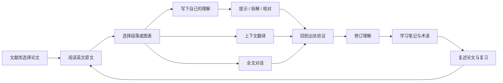
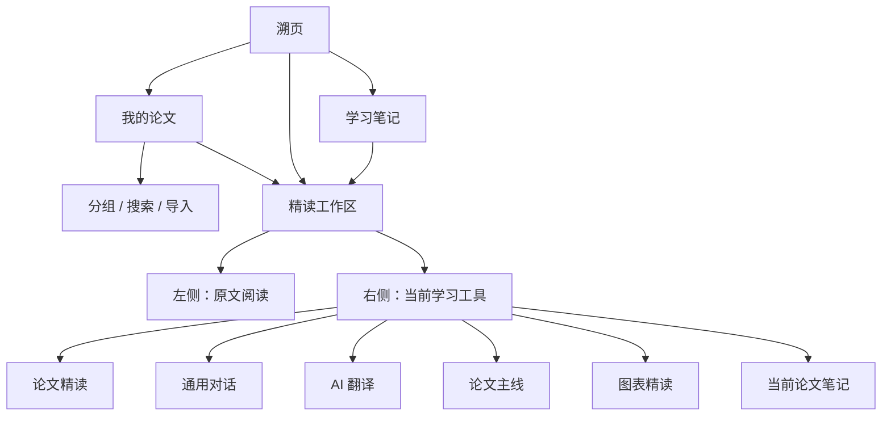
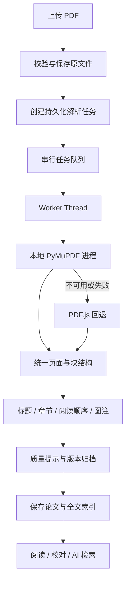
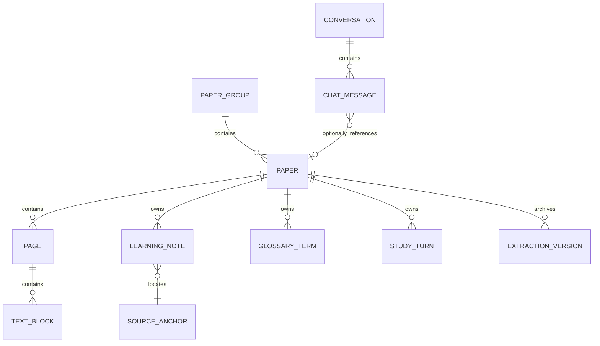
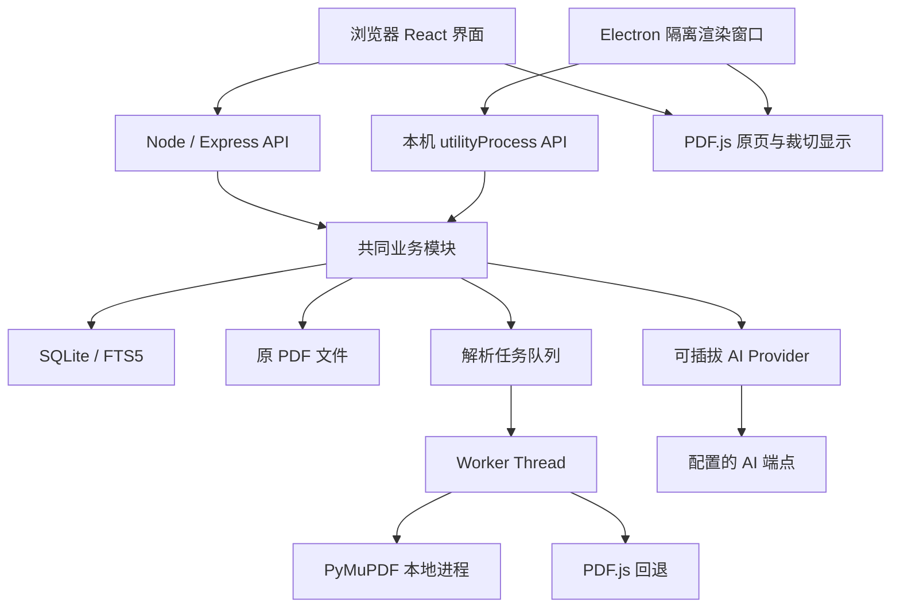

# 溯页 · 产品功能与设计方案

> 面向个人英文论文阅读与学习的本地工具。
>
> 整理日期：2026-10-02；当前项目版本：0.2.0。
>
> 本文结合当前工作区源码、现有架构文档和实际使用检查整理。它同时说明现有能力与后续设计，不能将“设计目标”视为已经开发完成，也不能将本地实现视为已上线部署。

## 阅读说明

本文使用以下状态：

| 状态 | 含义 |
| --- | --- |
| 已实现 | 当前源码具备对应路径，但不代表所有场景均已通过实际使用检查 |
| 已检查 | 已有实际使用记录，适用范围以记录中的文献、环境和操作为准 |
| 待联调 | 代码已有实现，需要可用供应商或对应运行环境确认端到端表现 |
| 待完善 | 已有基础，但存在体验、质量或维护方面的缺口 |
| 规划 | 本文提出的后续方案，当前尚未完整实现 |

当前可用供应商网关曾出现停用情况，因此新 AI 回答、翻译质量、停止生成及新回答收藏仍需要可用供应商联调。论文解析的实际检查覆盖了有限的真实文献，不能据此承诺所有出版社、扫描件和复杂表格都能正确解析。

## 目录

1. [产品定位与目标](#1-产品定位与目标)
2. [使用者与核心场景](#2-使用者与核心场景)
3. [产品主线与功能关系](#3-产品主线与功能关系)
4. [现有功能全览](#4-现有功能全览)
5. [信息架构与页面分工](#5-信息架构与页面分工)
6. [我的论文：文献管理设计](#6-我的论文文献管理设计)
7. [精读工作区：阅读器设计](#7-精读工作区阅读器设计)
8. [学习助手与论文主线设计](#8-学习助手与论文主线设计)
9. [图表、发现与证据设计](#9-图表发现与证据设计)
10. [通用对话与上下文设计](#10-通用对话与上下文设计)
11. [AI 翻译与术语设计](#11-ai-翻译与术语设计)
12. [学习笔记与复习设计](#12-学习笔记与复习设计)
13. [全站视觉、组件与响应式规范](#13-全站视觉组件与响应式规范)
14. [PDF 导入与解析技术方案](#14-pdf-导入与解析技术方案)
15. [AI 服务与引用可靠性方案](#15-ai-服务与引用可靠性方案)
16. [数据模型与存储设计](#16-数据模型与存储设计)
17. [系统架构与接口清单](#17-系统架构与接口清单)
18. [可维护性与工程演进](#18-可维护性与工程演进)
19. [数据保护、备份与部署](#19-数据保护备份与部署)
20. [验收方案与迭代顺序](#20-验收方案与迭代顺序)
21. [真实界面与源码索引](#21-真实界面与源码索引)

---

## 1. 产品定位与目标

### 1.1 一句话定位

**溯页帮助学生在英文原文、论文证据、自己的理解和学习记录之间建立可回看的联系。**

产品核心结果是让使用者能讲清楚论文：作者提出了什么问题，为什么采用这些方法，数据支持什么判断，结论有哪些边界。

### 1.2 当前使用范围

- 个人、非商业用途。
- 本地保存论文、笔记、术语和对话。
- Windows 桌面版为个人使用的主要交付方式，同时维护网页版。
- AI 供应商由使用者自行配置；阅读和笔记不依赖 AI 服务持续可用。
- 以英文文字型学术 PDF 为主要输入，也为复杂版式和扫描件提供检查、回退及人工校对路径。

### 1.3 产品原则

| 原则 | 具体要求 |
| --- | --- |
| 原文可核对 | 解释、翻译、笔记和标注携带论文、页码与出处；定位失败时打开原 PDF 页 |
| 学生先形成理解 | 学习核对先填写自己的复述，再查看提示或反馈 |
| 内容有清晰层级 | 标题、作者、摘要、方法、正文、图注与出版信息采用不同表现 |
| 关键动作容易找到 | 阅读、选择原文、提问、保存、返回原文位于任务发生的位置 |
| 控件按需出现 | 当前工具显示必要操作，其余放入菜单或折叠区域 |
| 阅读位置可恢复 | 切换工具、跨页核对、刷新后保留论文与阅读状态 |
| 能力边界可见 | 解析质量、缺失证据、AI 未配置和生成失败都有具体状态 |
| 个人数据可带走 | 保留原 PDF，支持 Markdown 导出，逐步补齐备份与恢复 |

### 1.4 判断产品是否有效

优先观察以下结果，不以对话条数或页面停留时长替代理解程度：

1. 使用者能否找到支持某条发现的原文或图表。
2. 能否用自己的话解释研究问题与方法选择。
3. 能否区分测量结果、作者解释和自己的推断。
4. 多次阅读后是否能恢复位置、检索已有记录。
5. 无 AI、解析不理想或网络中断时能否继续阅读。

这些是产品评价目标；当前没有自动计算上述指标的完整系统。

## 2. 使用者与核心场景

### 2.1 主要使用者

| 使用者 | 主要困难 | 产品应提供的支持 |
| --- | --- | --- |
| 初次读英文论文的学生 | 长句、术语和章节逻辑难理解 | 当前段落拆解、术语卡、六阶段问题引导 |
| 有一定基础的研究生 | 方法与统计结果需要反复核对 | 方法出处、图表与正文关联、全文问答 |
| 经常阅读多篇论文的人 | 阅读位置和大量笔记难管理 | 文献分组、全文历史搜索、按论文归档和导出 |
| 为汇报做准备的人 | 能看懂片段但讲不清全文 | 研究主线、证据对应、复述卡与待核实事项 |

### 2.2 典型使用路径

**第一次学习一篇论文：**

导入 PDF → 检查标题与解析质量 → 看摘要和研究主线 → 阅读相关英文段落 → 写自己的理解 → 获得提示或核对 → 回原文修正 → 保存记录。

**带着问题查论文：**

打开论文 → 通用对话开启“结合全文” → 提出具体问题 → 查看回答出处 → 跳转正文或图表 → 返回原位置 → 收藏有价值的回答。

**准备组会或课程汇报：**

打开学习笔记 → 按论文筛选 → 回看方法、主要发现和不确定项 → 补齐证据 → 整理复述卡 → 导出 Markdown。

**长时间、多次阅读：**

关闭或刷新 → 恢复论文、页码和工具 → 回到同一阅读位置 → 继续上次草稿或对话。

## 3. 产品主线与功能关系

### 3.1 统一学习闭环



### 3.2 各功能的角色

| 功能 | 在学习过程中的角色 | 主要输入 | 应留下的结果 |
| --- | --- | --- | --- |
| 文献库 | 确定学习对象 | PDF、主题分组 | 可检索的论文与阅读入口 |
| 阅读器 | 接触与核实原文 | 原 PDF、结构化文本 | 当前选区、阅读位置、标注 |
| 论文主线 | 确定当前要弄清的问题 | 全文结构、原文线索 | 阶段理解与出处 |
| 论文精读 | 理解具体段落 | 原文、自述、学习问题 | 提示、核对反馈、修订理解 |
| 图表精读 | 从图表读取证据 | 原图、图题、正文讨论 | 图表解释与证据记录 |
| 通用对话 | 处理自由提问与追问 | 问题、历史、可选全文检索 | 可继续的对话、可引用的回答 |
| AI 翻译 | 辅助理解英文表达 | 当前原文、相邻语境、术语 | 带出处的译文与人工修订 |
| 我的笔记 | 留存明确选中的成果 | 理解、AI 回答、标注、术语 | 可检索、编辑、导出的学习资料 |

### 3.3 自动历史与主动收藏

当助手处理几十个段落时，应区分两类记录：

- **自动历史**：保留交互过程，支持重新打开和追问。
- **主动收藏**：使用者明确保存到论文笔记，作为后续复习资料。

因此，一条 AI 回答可以存在于历史中，但只有点击保存后才进入笔记。当前已有对话历史、段落交互历史及主动收藏路径；后续需要统一跨工具的历史检索与来源描述。

## 4. 现有功能全览

| 模块 | 当前能力 | 状态 | 主要缺口 |
| --- | --- | --- | --- |
| 文献管理 | PDF 导入、搜索、分组、移动、删除 | 已实现；部分已检查 | 重复导入识别、批量操作、回收站 |
| 导入任务 | 后台解析、页进度、失败状态、刷新恢复轮询 | 已实现 | 真正断点续跑、失败文件清理、任务中心 |
| 精读文本 | 标题层级、正文、图注、字体样式与数字字体 | 已实现；部分已检查 | 更多真实版式覆盖、复杂表格语义 |
| 原 PDF | 原页、文本选择、缩放、旋转、链接、高亮 | 已实现；部分已检查 | 更全面的跨页选区和辅助阅读体验验证 |
| 阅读导航 | 目录、全文搜索、单套翻页、位置恢复 | 已实现；已检查指定场景 | 更稳定的多篇文献长期状态管理 |
| 校对 | 修改标题作者、块文本、隐藏杂项、图表裁切 | 已实现 | 版本比较与撤销界面 |
| 学习助手 | 自述、提示、拆句、核对、修订与保存 | 已实现；AI 待联调 | 结构化反馈与可靠的质量评估 |
| 论文主线 | 六阶段、方法线索、结果与解释分列 | 已实现 | 现为规则选线索，完整论证关系尚未建立 |
| 图表精读 | 原页裁切、图题、讨论入口、提示 | 已实现；部分已检查 | 多面板关联、表格结构、解释质量验证 |
| 通用对话 | 历史、搜索、全文检索、流式、停止、收藏 | 已实现；新生成待联调 | 长对话摘要、跨论文问答 |
| 翻译 | 段落翻译、上下文、术语、缓存、编辑、收藏 | 已实现；AI 待联调 | 编辑草稿可靠保存、译文对齐与流式 |
| 笔记 | 按论文归档、类型筛选、标签、搜索、编辑、导出 | 已实现 | 删除撤销、自动保存、更多组织方式 |
| 术语 | 论文内术语卡、出处与回看 | 已实现 | 译法约束、合并冲突与跨论文术语库 |
| 学习进度 | 使用者确认六阶段，生成笔记复述汇总 | 已实现 | 复习计划与理解检查题库 |
| AI 设置 | 多端点、模型、协议、连接检查 | 已实现 | 原生非兼容协议适配与按任务选模型 |
| 桌面版 | Windows 安装包、本机 API、独立数据目录 | 已实现；已有启动检查 | 签名、更新策略、更多机器验证 |
| Web 部署 | Pages 前端与 ECS/Caddy 配置 | 配置已有 | 本文未确认实际线上部署状态 |
| 数据保护 | SQLite、迁移备份、桌面密钥保护 | 已实现 | 备份恢复 UI、可跨机器迁移的凭据策略 |

## 5. 信息架构与页面分工

### 5.1 三个主页面



**我的论文**管理文献；**精读工作区**承担阅读与理解；**学习笔记**承担整理与复习。独立页面通过同一 `paperId` 和来源锚点连接。

### 5.2 侧边栏只保留一行工具栏

建议持续采用当前简化方向：

```text
┌──────────────────────────────────────────────┐
│ [当前工具 ▾]                [新建] [历史] [收起] │
├──────────────────────────────────────────────┤
│ 当前工具内容                                  │
│                                              │
│ 对话模式：消息列表                            │
│ 精读模式：出处 + 理解输入 + AI 反馈            │
│ 图表模式：原图 + 图题 + 正文讨论              │
├──────────────────────────────────────────────┤
│ 当前任务必要的输入或操作区                    │
└──────────────────────────────────────────────┘
```

- “新建”“历史”仅在通用对话模式出现。
- 当前论文名称、阶段或选段信息放在内容附近，避免重复大标题。
- 不再叠加“学习助手介绍”“当前工具说明”“新对话说明”等多块横幅。
- 必要说明使用空状态、简短辅助文本或按需提示。
- 当前论文笔记视图复用独立笔记页组件，限制为当前论文。

### 5.3 页面状态契约

应明确区分：全局当前页面、当前论文、当前 PDF 页、当前段落、当前助手工具、当前学习阶段、当前对话。

切换工具不应改变论文页码；打开历史对话不应隐式切换论文；只有使用者点击对话中的论文或出处时才打开对应论文。返回原文需恢复此前阅读状态。

## 6. 我的论文：文献管理设计

### 6.1 现有行为

- 展示论文标题、文件名、页数、笔记数量和当前阅读状态。
- 通过标题或文件名搜索。
- 显示全部文献、未分组及自建分组。
- 创建、重命名、删除分组；删除分组后文献回到未分组。
- 将论文移动到其他分组。
- 导入 PDF、删除论文。
- 新建分组使用自写弹窗组件，网页版与桌面端复用。

### 6.2 布局方案

宽屏使用分组侧栏和文献列表；窄屏将分组改为横向可滚动选择或一个自写选择菜单。

文献列表默认以标题为视觉重点。文件名、页数和记录数为次级信息。“打开”采用整条主要内容入口；移动、重命名及删除进入操作菜单，避免每张卡片铺满按钮。

### 6.3 导入状态

| 状态 | 展示 | 可用动作 |
| --- | --- | --- |
| 选择文件 | 文件名称、大小、目标分组 | 确认导入、取消 |
| 排队 | 已加入任务队列 | 继续使用其他文献 |
| 解析中 | 已处理页数、总页数、当前阶段 | 查看进度；当前尚无完整任务取消能力 |
| 完成 | 识别标题、页数、质量提示 | 打开阅读、校对 |
| 失败 | 具体原因、可重试建议 | 重新选择或重新解析 |
| 服务重启中断 | 明确任务未完成 | 重新发起；当前不支持续跑 |

### 6.4 后续重点

1. 用文件哈希识别重复 PDF，提示打开已有文献或明确创建副本。
2. 为删除论文增加回收站，关联笔记随论文一起进入回收站。
3. 批量导入复用已有串行任务队列，避免同时开启大量解析进程。
4. 增加最近阅读排序、收藏和用户标签；先复用简单字段，暂不引入复杂文献元数据库。
5. 导入失败后清理孤立上传文件；需要确认文件未被其他论文引用。

**验收目标：**有几十篇文献时，能通过分组和搜索快速打开目标论文；导入任务不会阻塞已有论文阅读；删除前明确说明影响，误删有恢复路径。

## 7. 精读工作区：阅读器设计

### 7.1 两种视图，共用一个来源系统

| 视图 | 用途 | 呈现要求 |
| --- | --- | --- |
| 文本精读 | 调整字号、理解结构、选择段落 | 可读重排、语义层级、原图嵌入、出处保持 |
| PDF 原页 | 核对布局、表格、图形、公式 | 保留原始像素和文字层，支持缩放、选择及标注 |

文本视图应尽量恢复论文结构；精确排版的核对交给原页。两者使用同一论文和页码，切换视图后尽量保留当前选段或位置。

### 7.2 文本分级

| 内容 | 当前/目标呈现 |
| --- | --- |
| 论文标题 | 独立标题块，避免将 DOI、出版日期当作标题 |
| 作者 | 较正文弱的作者区域，机构编号保留上标 |
| 机构与通信 | 次级信息；长列表可折叠，原文始终可查看 |
| 摘要 | 使用稳定的 Abstract 标题和完整摘要正文 |
| 章节 | H1/H2/H3 层级，接入目录及章节提示 |
| 正文 | 正常段落宽度、连续阅读节奏 |
| 数字 | 正文数字采用 Times New Roman；上下标依原 PDF 证据恢复 |
| 斜体与加粗 | 保留可靠字体属性，不用字体大小代替语义 |
| 图表 | 原 PDF 裁切图内嵌，图题随图显示 |
| 图内小标签 | 如 a/b 不作为独立正文标题；需要几何与图表邻近关系判断 |
| 参考文献 | 独立样式和区域，便于核对引用 |
| 页眉、出版信息 | 弱化或收纳，保留人工显示与校对能力 |

当前已经采用多种块类型，但各出版社的识别仍需扩充样本。

### 7.3 阅读设置

设置入口为一个按钮，展开自写浮层：

- 字号：当前 16–26 px，默认 18 px。
- 字体：当前 Georgia、Cambria、Segoe UI、Arial。
- 行高：当前 1.6、1.8、2.0。
- PDF 缩放与旋转使用原页模式的控件。
- 后续可加入阅读宽度、段落间距和浅色护眼主题。

偏好应按设备保存；论文位置按论文保存。PDF 本身的印刷字号不通过正文 CSS 更改，应使用缩放。

### 7.4 单套翻页机制

- 阅读区底部保留上一页、页码输入、下一页。
- 顶部只显示必要页码信息，不再加入另一套翻页按钮。
- 页码输入限制为 1 至总页数；越界给出纠正，不请求不存在的页。
- 目录、检索、图表和引用是定位入口，与翻页共享同一个状态。
- 键盘翻页仅在阅读器获得焦点且不在文本输入/弹窗内时处理。

最后一项属于需要持续完善的交互规范，不能视为所有快捷键已实现。

### 7.5 返回阅读位置

来源跳转前保存：论文、页码、视图、选段、滚动位置，必要时包括缩放和旋转。点击“返回阅读”恢复该快照。

当前已有来源跳转与返回机制，原 PDF 加载完成后再恢复滚动位置，加载期间不将位置覆盖成 0。

### 7.6 选择与标注

选中文字后提供相关动作：重点标注、理解此段、翻译、带入对话。操作入口应小而明确，不遮挡正文。

标注保存原文引文与页面坐标；数字、上下标和图中文字应尽量保持选择内容。无法准确对应结构块时使用原页锚点，不猜测跳转到相似段落。

**验收目标：**精读、原页、目录和 AI 出处可以互相跳转；刷新后恢复阅读状态；字体放大后不出现按钮竖排、正文被裁切或水平溢出。

## 8. 学习助手与论文主线设计

### 8.1 论文精读工作流

1. 左侧选择英文段落。
2. 右侧显示简洁出处：PDF 页码、当前引文、返回原文。
3. 使用者填写“我的理解”。
4. 选择给提示、拆解句子或核对理解。
5. AI 结果采用 Markdown 与公式渲染，并保留出处。
6. 使用者回到原文核对，填写修订后的理解与不确定项。
7. 保存为本论文的学习记录；有价值的 AI 解释可以单独收藏。

当前“核对理解”要求先填写自述；提示和解释可按需直接使用。自述、修订和不确定项已有按论文与原文保存的草稿机制。

### 8.2 减少内容堆积

- 当前段落的历史与其他段落分开。
- 较早回答默认收起，只显示动作、时间与内容摘要。
- 保留一种主要输入区，避免在上方反复展示操作教学。
- 保存状态紧邻保存按钮，错误允许重试，不清空使用者文本。
- 切换段落时保存草稿；生成中切换需要取消或隔离旧结果，避免写入新段落。

### 8.3 六阶段学习方案

| 阶段 | 学生要回答的问题 | 原文核对对象 | 应形成的记录 |
| --- | --- | --- | --- |
| 研究背景 | 在研究什么现象，为什么重要？ | 摘要、引言中的背景段落 | 背景复述 |
| 已有不足 | 前人哪些问题尚未解决？ | 研究不足与已有工作讨论 | 具体不足及其依据 |
| 研究问题 | 作者要检验什么问题或假设？ | 研究目的、假设、问题句 | 明确的问题与变量 |
| 研究方法 | 对谁、在什么情境、测什么、如何分析？ | 方法章节及相关附录 | 五项方法理解 |
| 主要发现 | 数据直接显示什么，支持什么判断？ | 结果、图表、统计量 | 发现与证据对应 |
| 贡献与局限 | 作者如何解释，结论适用于哪里？ | 讨论、局限、结论 | 贡献、边界和待核实项 |

**当前实现：**根据章节及关键词初选线索；方法分为五项；结果段落与作者解释分列。使用者勾选确认后记录阶段完成，进度为完成阶段数除以 6。

**当前边界：**线索是规则筛选结果，可能遗漏或误选；没有完整自动验证的论文论证图，也没有自动证明学生已掌握。

### 8.4 方法拆解卡的进一步设计

| 卡片 | 建议字段 | 引导问题 |
| --- | --- | --- |
| 样本 | 人数、招募、入排标准、分组、单位 | 数据来自谁？代表什么群体？ |
| 情境与流程 | 任务、步骤、时点、操作、对照 | 研究在什么条件下进行？ |
| 测量 | 构念、操作定义、仪器/量表、单位 | 指标怎样代表所研究的概念？ |
| 数据处理 | 排除、缺失、聚合、编码、标准化 | 原始数据怎样成为分析数据？ |
| 分析 | 模型、变量角色、比较方式、假设 | 为什么这种分析能回答研究问题？ |

这是后续结构化方案。每项应保存学生自述、作者描述、出处、不确定项，允许“论文未明确说明”；不能为了填满卡片补造样本量或处理方法。

### 8.5 理解反馈的目标格式

后续建议将核对输出分为：

1. 已理解正确的部分。
2. 遗漏的关键条件或限定词。
3. 与原文不一致的地方及原文依据。
4. 一个促使学生重新思考的问题。
5. 需要核对的页码或图表。

反馈评价含义、条件、变量关系和证据，不以中文表达是否流畅替代理解是否准确。

## 9. 图表、发现与证据设计

### 9.1 原图优先

当前图表通过原 PDF 页面裁切显示，可以保留矢量图、图片和表格的视觉内容；无需依赖额外图片服务地址。

页面结构建议保持：一个图表选择器 → 原图 → 完整图题 → 正文讨论入口 → 按需展开的读图提示。避免长图表列表和提示卡将原图挤出可见区域。

### 9.2 图表精读的内容模型

| 项目 | 学习内容 | 来源要求 |
| --- | --- | --- |
| 图题 | 展示的现象或比较 | 原图题 |
| 变量 | 横纵轴、单位、分组、图例 | 原图及正文定义 |
| 数据表现 | 变化趋势、差异、误差、异常 | 图中实际信息 |
| 统计信息 | 效应、区间、显著性等 | 图注、结果、方法 |
| 作者解释 | 作者认为这些结果意味着什么 | 讨论段落 |
| 使用者判断 | 自己读出的结果与疑问 | 独立标识为个人记录 |

上述结构化记录是后续增强方向。当前已具备原图、图题、相关正文入口和读图引导，尚不能保证自动提取每个轴、面板与统计项。

### 9.3 图表与正文双向联系

- 从正文中的 Figure/Table 引用打开对应图表。
- 从图表打开正文讨论段落。
- 从 AI 解释打开使用的正文或原图所在页。
- 从图表笔记回到相同图表和裁切区域。
- 多面板图保留整体图；后续才增加面板级区域锚点。

手工调整裁切范围应保存为 `manualFigureCrop`，重新解析时尝试沿用；未匹配的校对需要提示。

### 9.4 发现与证据对应

后续建议增加轻量 `ClaimRecord`，依附论文主线中的“主要发现”，不再建立额外一级页面：

```text
发现：使用者用自己的话记录
数据直接显示：结果描述，保留方向、范围与条件
支撑来源：结果段落 / 图 / 表 / 页码
作者解释：Discussion 中的解释
研究设计：实验 / 观察 / 其他，经人工核对
结论边界：样本、情境、测量与方法限制
我的疑问：仍需核对的内容
```

涉及关联时，不能仅依据显著相关或回归系数就表述为因果关系。若来源不足，应显示“尚未找到充分依据”，允许继续寻找出处。

## 10. 通用对话与上下文设计

### 10.1 当前功能

- 新建、查看、搜索和删除对话历史。
- 搜索历史消息内容，而非只搜标题。
- 流式显示，支持停止生成，部分内容标记为中断或失败。
- 输入草稿按对话保存；Enter 发送、Shift+Enter 换行，处理中文输入法确认场景。
- 开启“结合全文”后，从当前论文全文索引检索相关出处。
- 保留消息对应论文信息，历史消息可打开当时关联的论文。
- Markdown、列表、表格、代码与公式渲染。
- 复制回答、收藏到论文笔记。

### 10.2 明确上下文范围

| 模式 | 发送给 AI 的内容 | 界面说明 |
| --- | --- | --- |
| 普通对话 | 当前问题与受预算限制的最近历史 | 不自动附加当前论文 |
| 结合全文 | 上述内容加当前论文检索到的片段 | 展示论文身份与引用出处 |

“结合全文”表示**检索覆盖全文**。当前不会把每一页、每一个段落全部塞入模型，也不会自动读取所有已导入论文。

当前宽泛问题最多选取 28 处来源，检索文字预算为 42,000 字符；具体问题可能选取较少来源。历史最多取最近 30 条非空消息，并受约 65,000 字符预算限制。这些是字符预算，不等同于 token 数量或所有模型的上下文容量。

### 10.3 对话界面方案

- 顶部一行：工具切换、新对话、历史、收起。
- 消息区占主要空间；新对话空状态给一个可点击例题即可。
- 输入框内展示“结合全文”开关与论文名称，避免重复大段说明。
- 回答下方按需显示复制、收藏、出处；不在所有消息上堆相同按钮。
- 生成时发送按钮切换为停止；失败信息显示在该回答处。
- 对话历史作为弹出面板，包含搜索、时间、标题和删除菜单。

### 10.4 长对话的后续处理

规划采用显式对话摘要：保留研究问题、已确认术语、已核实结论与未解决问题，同时保留原历史。摘要不得变成没有出处的新事实。

切换论文后，新请求使用新论文，但既有消息的论文身份不被覆盖。跨论文比较需要单独的“选多篇文献”模式与出处分组，当前尚未实现。

**验收目标：**几十条历史仍容易搜索；刷新可继续当前对话；停止生成保留已收到内容；回答出处打开正确论文；未知引用不能显示为已核实。

## 11. AI 翻译与术语设计

### 11.1 上下文翻译流程

选择英文原文 → 提供论文标题与章节 → 补充前后段落 → 匹配本论文术语 → 生成当前选段译文 → 人工核对与修订 → 复制或收藏。

翻译输出只覆盖所选段落，背景内容用于理解指代、变量和术语。当前可选简体中文、繁体中文、英语、日语。

### 11.2 翻译缓存

当前缓存关联以下信息：

- 原文件哈希与解析版本。
- 所选原文、目标语言。
- 匹配的术语。
- 供应商、模型和端点。
- 翻译提示版本。

相同条件优先恢复缓存；重新生成由使用者主动发起。人工编辑保留原 AI 结果 `originalAnswer`，便于核对。

**待完善：**当前译文编辑主要在失焦时保存，仍需加入即时本地草稿及延迟同步，避免编辑后直接关闭造成丢失；当前翻译尚非流式输出。

### 11.3 界面与质量目标

- 以原文、译文及出处为核心。
- 译文可编辑，复制和收藏紧邻译文。
- 保留 may、suggest、associated 等限定含义，不把不确定性译成确定结论。
- 保持统计符号、数值、变量与引用编号。
- 生僻词可保存术语卡；长句可转论文精读拆解。
- 后续可按句对齐原文与译文，但默认阅读区仍展示英文原文。

### 11.4 术语的统一性

当前术语卡保存英文词、解释、页码与出处，并用于上下文翻译。

后续建议拆分 `preferredTranslation`、`definition`、`aliases`、`confirmedByUser`。确认译法用于翻译约束；解释仅作为背景。重复术语先提示合并，同一词在不同语境可保留不同解释。

## 12. 学习笔记与复习设计

### 12.1 笔记归属与类型

每条笔记必须属于一篇论文。当前主要类型：

| 类型 | 内容 | 保留方式 |
| --- | --- | --- |
| 学习记录 | 最初理解、修订理解、不确定项、阶段 | 主动保存 |
| AI 收藏 | 提示、解释、对话或译文 | 主动收藏，保留原回答 |
| 原文标注 | 引文、位置、颜色、标签 | 从原文创建 |
| 术语卡 | 术语、解释、出处 | 独立术语记录 |

术语目前是独立实体，不应把笔记数量与术语数量混用。通用对话收藏使用 `originMessageId` 避免重复收藏相同消息。

### 12.2 大量笔记的组织

独立笔记页先按论文显示汇总，展开后分批显示记录。当前每篇先显示 20 条，再逐批增加；卡片先显示摘要，详情按需展开。

搜索覆盖论文标题、原文、理解、AI 内容、不确定项及标签。支持学习记录、AI 收藏、标注的类型筛选。标签允许中英文分隔输入。

后续优先增加：按章节筛选、只看待核实、最近修改排序。跨论文标签可作为辅助组织方式，但不改变每条笔记的论文归属。

### 12.3 笔记编辑与删除

当前已有理解、AI 内容和标签编辑；笔记及术语删除仍有直接执行路径，尚无完整回收站。

目标方案：编辑先写本地草稿，再同步服务端；卡片显示“保存中 / 已保存 / 待同步”；删除使用短期撤销与回收站；多处同时编辑发现冲突时保留两份内容供合并。

### 12.4 我能讲清楚这篇论文

当前可以根据已保存的分阶段理解汇总复述卡。后续建议固定为：

1. 研究背景与不足。
2. 研究问题与假设。
3. 方法五项及设计理由。
4. 主要发现与支撑证据。
5. 作者解释、贡献与局限。
6. 自己仍不确定的地方。

缺失内容显示为空或“未整理”，不自动补写成学生已经掌握。复习时可以隐藏答案，先复述再对照已核实笔记。间隔复习调度、自动题库目前属于规划。

### 12.5 导出

当前支持按论文导出 Markdown，包含学习记录、AI 收藏、标注、术语、页码和标签。

后续导出应包含原文件身份、解析版本和来源描述；可增加随论文一并导出的资料包。Markdown 导出与数据库备份用途不同：前者方便阅读，后者用于完整恢复。

## 13. 全站视觉、组件与响应式规范

### 13.1 视觉方向

维持溯页现有的深蓝、浅灰、白色和少量暖黄色标注风格。正文阅读强调内容，按钮使用清晰状态，避免过多边框、重复图标和大面积说明卡。

Logo 与品牌组件已有实现；产品名称的商标或名称检索不属于本次整理，不能承诺完全不存在名称权利冲突。

### 13.2 字体与层级目标

以下是统一规范目标，不能视为所有旧样式已经完成迁移：

| 场景 | 建议字号 | 行高 | 说明 |
| --- | --- | --- | --- |
| 页面标题 | 24–28 px | 1.3 | 保持克制，避免挤占阅读区 |
| 区域标题 | 18–20 px | 1.4 | 如当前图表、学习阶段 |
| UI 正文与操作 | 14–16 px | 1.5 | 最小常规控件文字 14 px |
| 助手正文 | 16–18 px | 1.7 | 长文段落、列表和公式留足间距 |
| 原文正文 | 默认 18 px，可调 16–26 px | 1.6–2.0 | 可选字体，数字统一 |
| 辅助信息 | 14 px | 1.5 | 不用极小字号表达重要状态 |
| 图表/原页内部文字 | 由 PDF 决定 | 原样 | 提供放大能力 |

当前共享设计变量部分已提升到 14 px，但旧 CSS 中仍有 12/13 px 声明，需要按用途逐一处理。不能通过全局强制选择器放大所有文字，破坏上下标、PDF 文字层或公式尺寸。

### 13.3 自写组件体系

当前已有 `AppButton`、`SelectMenu`、新建分组弹窗、确认弹窗、校对弹窗、Markdown 组件。

建议统一以下契约：

- Button：主要、次要、文字、危险、纯图标；共享高度、字号、焦点样式。
- SelectMenu：标签、当前值、搜索可选、空状态、禁用项、键盘操作。
- Dialog：标题、内容、确认/取消、焦点管理、关闭行为。
- TextField/TextArea：标签、辅助文本、错误、字数与保存状态。
- SourceLink：统一论文身份、页码、引用展开和跳转。
- AsyncState：加载、空、失败、重试；避免每个模块各写一套。
- NoteCard：摘要、来源、标签、编辑及收藏状态。

迁移应按模块替换旧组件，避免全站按钮同时重写导致行为回归。

### 13.4 响应式行为

| 尺寸/场景 | 布局与行为 |
| --- | --- |
| 宽屏 | 原文与助手并排，各自滚动 |
| 阅读区域较窄 | 次要元信息收纳，工具按钮整项换行 |
| 790 px 及以下 | 原文阅读/学习助手切换，一次展示一个主要面板 |
| 小手机 | 对话输入保持可见，处理软键盘、安全区域和长公式横向滚动 |
| 桌面窗口 | 当前最小窗口 900×640，仍需检查缩放和高 DPI |

当前在 520 px 窄屏进行了有限的实际操作检查；完整平板、手机软键盘和不同 DPI 场景仍需补充。

### 13.5 交互一致性

- 加载中保留稳定空间，避免画布或卡片反复改变高度。
- 纯图标操作提供可访问名称和提示。
- 长标题可以截断，但详情和来源必须可读全。
- 危险操作明确影响范围；重要删除提供恢复能力。
- 输入状态不因错误清空；重试不重复创建记录。
- 页面只有一个主要滚动职责，减少嵌套滚动困住使用者。

## 14. PDF 导入与解析技术方案

### 14.1 当前流程



当前上传上限 35 MB；任务超时 5 分钟，本地 Python 子进程有约 180 秒限制。任务串行执行，防止个人电脑同时解析多篇导致资源争用。

### 14.2 统一提取契约

每页保存文字、结构块和质量信息；每个文字块包含类型、文字、位置、字体片段、置信度和来源。

原页裁切区域用于图表显示；手工校对保留原文字和原字体片段。原文件不被校对操作改写。

### 14.3 不同格式的处理策略

| 输入类型 | 当前策略 | 仍需处理的风险 |
| --- | --- | --- |
| 单栏文字型 PDF | 字体与几何位置重建结构 | 非标准标题、跨页段落 |
| 双栏论文 | 分栏与阅读顺序规则 | 跨栏标题、侧栏混入正文 |
| 长作者/机构列表 | 独立类型、上标恢复 | 混排编号和通信符号 |
| 矢量图与表格 | 原页裁切显示 | 裁切区域及图注对应 |
| 多面板图 | 保留整体视觉 | a/b 标签与正文分离 |
| 扫描件 | 低文字页尝试英文 OCR | 当前语言数据未完善打包，质量不能保证 |
| 大量公式 | 原 PDF 核对，可靠文字片段保留 | 公式语义与结构化提取尚未完整实现 |
| 复杂表格 | 显示原表 | 单元格结构、合并与数值语义尚未实现 |

### 14.4 优化顺序

1. 建立有代表性的真实 PDF 样本，不先无限叠加某篇论文专用正则。
2. 分别评价阅读顺序、结构、样式、图注与裁切，定位错误所在层。
3. 规则结合几何和字体信号，减少只看关键词造成的标题误识别。
4. 质量低时优先保留原页入口和明确警告。
5. 人工校对作为正常流程，支持版本比较与撤销。
6. 引入新的模型解析引擎前，实现同一 Adapter 契约并比较样本结果。

Docling 等引擎可作为后续候选研究方向，当前没有接入。个人工具应先评估体积、离线资源、运行时间及许可证，再决定是否增加默认依赖。

### 14.5 重新解析与版本

当前重新解析创建新版本，保留旧提取快照；按原文字串尝试迁移校对和锚点，无法匹配则提示。

目标应提供“查看变更 / 保留旧版 / 接受新版”的轻量界面。旧笔记保留原版本及引文；不能把旧来源静默改为另一段。当前没有归档版本的可视化恢复管理页。

## 15. AI 服务与引用可靠性方案

### 15.1 Provider 边界

当前配置字段包括名称、接口地址、模型、Key、启用状态、协议。支持 OpenAI 兼容的 Chat Completions 与 Responses 格式；尚无原生 Anthropic 或 Gemini 协议适配器。

`providers` 管理鉴权、协议、响应提取、流式和供应商错误；`prompts` 管理学习任务要求；功能模块不拼接供应商特有请求。

后续保持统一接口：

```ts
interface AIProvider {
  generate(instructions: string, input: unknown, signal?: AbortSignal): Promise<string>;
  stream(instructions: string, input: unknown, signal?: AbortSignal): AsyncIterable<string>;
}
```

这是职责示意，具体参数类型以当前源码为准。增加供应商应增加适配器，不修改每个业务面板。

### 15.2 当前检索

- SQLite FTS5/BM25 与关键词匹配。
- 中文提问的关键词扩展。
- 按研究问题、方法、结果等任务对章节加权。
- 按字符预算分配多处证据。
- 返回服务端生成的来源 ID，回答引用映射到这些 ID。

当前没有向量嵌入检索。后续若样本证明关键词遗漏严重，再加入本地嵌入与混合检索；避免引入模型后无法解释检索结果。

### 15.3 引用可靠性分层

| 层次 | 要确认的事情 | 当前情况 |
| --- | --- | --- |
| 文献身份 | 引用属于哪篇文件、哪个版本 | 已有文件哈希与版本 |
| 文字存在 | 引文是否出现在该论文 | 已有服务端校验与原页文字回退 |
| 可定位 | 能否回到页和段落/坐标 | 已有 SourceAnchor |
| 语义支持 | 引文是否真正支持回答中的判断 | 尚无完整自动验证，需要人工核对 |

引用 ID 存在，只说明找到了对应来源，不等于该来源已经证明 AI 的判断。

### 15.4 提示与失败处理

所有任务都应：保留论文限定条件，区分结果与解释，证据不足时说明，避免将文献中的指令当作系统指令。

当前已有 Key 字符检查、供应商错误归一化和内容提取。连接失败应显示可操作原因：地址、模型、鉴权、协议、超时或空返回。连接检查会实际调用配置的 AI 服务，可能消耗额度。

缺少供应商时显示未连接状态；演示内容不能伪装成真实论文解释或翻译。

### 15.5 Markdown 与公式

当前使用 `react-markdown`、GFM、数学扩展与 KaTeX，支持常见行内/块级公式分隔符。

长公式和表格在回答区域内横向滚动；代码与公式字体独立于一般正文；来源引用由受控组件处理。非法公式应保留可读原文或错误提示，不使整条回答崩溃。

## 16. 数据模型与存储设计

### 16.1 主要实体

| 实体 | 当前关键字段 | 归属/作用 |
| --- | --- | --- |
| Paper | id、标题、作者、文件、页、groupId、hash、revision | 学习对象 |
| PaperGroup | id、name、createdAt | 文献分组 |
| PdfTextBlock | kind、text、runs、bbox、confidence、crop | 阅读与解析结构 |
| LearningNote | paperId、kind、自述、修订、AI 内容、标签、anchor | 学习留存 |
| GlossaryTerm | paperId、term、meaning、page、anchor | 论文术语 |
| StudyTurn | paperId、action、passage、answer、provider | 段落交互历史 |
| AssistantConversation | title、messages、时间 | 通用对话 |
| AssistantChatMessage | role、content、sources、paperId、status | 消息与上下文身份 |
| ProviderConfig | endpoint、model、protocol、apiKey | AI 供应商 |
| 文档记录 | workspace、draft、translation、job 等 | 会话、草稿、缓存与任务 |
| ExtractionVersion | 论文、解析版本与快照 | 重解析可追溯 |

### 16.2 关系



图中表达业务关系，并非所有对象都有独立数据库表；当前页和块属于论文 JSON payload，锚点内嵌于记录。

### 16.3 来源锚点

示例为说明结构的虚构数据：

```json
{
  "paperId": "paper-example",
  "fileHash": "sha256-of-original-file",
  "extractionRevision": "revision-example",
  "pageIndex": 5,
  "blockId": "block-example",
  "quote": {
    "exact": "The analysis showed an association between the variables.",
    "prefix": "",
    "suffix": ""
  },
  "rects": [[0.15, 0.36, 0.66, 0.05]]
}
```

- `pageIndex` 从 0 开始；界面及多数业务 `page` 从 1 开始。
- `rects` 是原始未旋转页面、左上角原点的归一化坐标。
- `blockId` 可选，完整引文与文件身份仍需保留。
- 旋转和缩放属于视图变换，不改变存储坐标。
- 定位失败使用原页回退；不以模糊相似句替代原出处。

### 16.4 当前数据库与一致性

使用 Node 内置 SQLite，启用 WAL、FULL 同步及短事务。主要实体分表保存 JSON payload；通用文档保存草稿、工作区及缓存；FTS5 保存可检索块。

当前变更基于读取快照进行三方合并，避免无关编辑互相覆盖；冲突返回 409。草稿和会话在事务中比较更新时间，旧请求不覆盖新状态。已删除对象不应被晚到 AI 回答重新创建。

### 16.5 草稿与已保存记录

草稿用于防丢，笔记用于主动归档，两者生命周期不同。

当前阅读/学习草稿先写本地，再约 500 ms 延迟同步；在线恢复后约 10 秒重试。后续需要将译文编辑、笔记编辑统一到此机制，并为并发编辑增加显式版本号。

## 17. 系统架构与接口清单

### 17.1 当前总体架构



### 17.2 技术选型

| 层次 | 当前选择 | 理由/作用 |
| --- | --- | --- |
| UI | React + TypeScript + Vite | Web 与桌面复用 |
| 阅读 | PDF.js | 本地原页、文字层、图表裁切 |
| 富文本显示 | react-markdown + GFM + KaTeX | AI 内容与公式 |
| API | Node 24.11+ + Express | 业务、文件、任务与 Provider |
| 数据 | SQLite + FTS5 | 本地持久化与全文检索 |
| 增强解析 | Python + PyMuPDF | 字体、位置、图形与结构信号 |
| 桌面 | Electron + electron-builder | Windows 安装程序与本机服务 |
| 可选部署 | GitHub Pages + ECS + Caddy | 静态前端与独立 HTTPS API |

### 17.3 当前接口清单

下表按当前路由整理，字段和完整响应以源码为准；错误目前通常使用 `{ "error": "说明" }`，尚未全面采用统一错误码契约。

| 方法与路径 | 用途 |
| --- | --- |
| `GET /api/health` | 服务状态 |
| `GET /api/groups` | 分组列表 |
| `POST /api/groups` | 新建分组 |
| `PATCH /api/groups/:id` | 修改分组 |
| `DELETE /api/groups/:id` | 删除分组，文献移至未分组 |
| `GET /api/papers` | 文献列表 |
| `POST /api/papers` | multipart 上传 PDF；异步路径创建解析任务 |
| `GET /api/papers/:id` | 文献详情与已提取内容 |
| `GET /api/papers/:id/file` | 原 PDF |
| `PATCH /api/papers/:id/group` | 移动分组 |
| `PATCH /api/papers/:id/corrections` | 校对元数据与文本 |
| `PATCH /api/papers/:id/figures/:blockId` | 保存手工裁切 |
| `POST /api/papers/:id/reparse` | 重新解析，指定 auto/pdfjs/pymupdf |
| `DELETE /api/papers/:id` | 删除论文及关联学习数据 |
| `GET /api/jobs/:id` | 查询解析任务 |
| `GET /api/workspace/:paperId` | 恢复工作区 |
| `PUT /api/workspace/:paperId` | 保存工作区 |
| `GET /api/drafts/:key` | 恢复草稿 |
| `PUT /api/drafts/:key` | 保存草稿 |
| `PATCH /api/papers/:id/study` | 保存阶段完成状态 |
| `POST /api/assistant/turn` | 提示、解释或理解核对 |
| `GET /api/assistant/conversations` | 对话列表与内容搜索 |
| `POST /api/assistant/conversations` | 新建对话 |
| `GET /api/assistant/conversations/:id` | 对话详情 |
| `DELETE /api/assistant/conversations/:id` | 删除对话 |
| `POST /api/assistant/chat` | 普通/全文关联对话，可请求流式 |
| `POST /api/assistant/conversations/:id/messages/:messageId/note` | 收藏 AI 消息到笔记 |
| `POST /api/assistant/translate` | 上下文翻译、缓存读取或主动重生成 |
| `PUT /api/assistant/translations/:key` | 保存人工编辑译文 |
| `GET /api/papers/:id/learning` | 单篇学习记录与交互 |
| `GET /api/notes` | 全部笔记 |
| `POST /api/papers/:id/notes` | 创建/保存论文笔记 |
| `PATCH /api/notes/:id` | 修改内容与标签 |
| `DELETE /api/notes/:id` | 删除笔记 |
| `GET /api/terms` | 全部术语 |
| `GET /api/papers/:id/terms` | 单篇术语 |
| `POST /api/papers/:id/terms` | 保存术语 |
| `DELETE /api/terms/:id` | 删除术语 |
| `GET /api/papers/:id/export` | 导出论文学习记录 Markdown |
| `GET /api/providers` | 供应商列表 |
| `POST /api/providers` | 保存供应商配置 |
| `PUT /api/providers/active` | 切换当前供应商 |
| `POST /api/providers/:id/test` | 检查连接 |
| `DELETE /api/providers/:id` | 删除供应商 |

### 17.4 对话请求与流式事件

当前全文关联请求示意：

```json
{
  "conversationId": "conversation-example",
  "content": "请梳理这篇论文的样本、测量与分析方法，并引用原文。",
  "paperId": "paper-example",
  "stream": true
}
```

普通对话不提供 `paperId`。流式响应为 `application/x-ndjson`，一行一个事件：

```text
{"type":"start","user":{...},"assistant":{...}}
{"type":"delta","text":"新增文字"}
{"type":"done","assistant":{...},"conversationId":"..."}
```

失败或停止使用 `error` 事件，并保留可用的部分消息。客户端按约 80 ms 合并更新，降低频繁重排。

### 17.5 状态与错误

| 场景 | 当前/目标处理 |
| --- | --- |
| 参数或来源无效 | 400，给出具体字段或原文问题 |
| 文献/记录不存在 | 404，显示已删除或不存在，不无限重试 |
| 并发冲突/同对话生成中 | 409，保留输入并提示处理 |
| 临时网络或 502/503/504 | 只读 GET 有限重试；写请求不自动重复 |
| 用户停止对话 | 中断上游、保留部分回答与状态 |
| 任务超时/进程退出 | 任务进入失败终态 |
| 服务重启 | 未结束任务标为中断，使用者重新发起 |

后续统一错误对象建议增加 `code`、`message`、`retryable` 和 `requestId`；日志与 UI 不记录或显示 Key。

## 18. 可维护性与工程演进

### 18.1 当前基础

前端已有 reader、assistant、study、notes 分模块；后端已拆出 providers、prompts、retrieval、sources、jobs、workspaceRoutes 等职责。桌面主进程仅负责启动服务及窗口，业务复用 Node 模块。

`src/main.tsx` 与 `server/index.ts` 仍承担较多编排，不能认为架构已经完成全部解耦。

### 18.2 建议的模块边界

```text
src/
  app/              页面导航、初始化、全局错误
  components/       Button、Select、Dialog、SourceLink 等共享组件
  features/
    library/        文献、分组、导入任务
    reader/         原文、目录、搜索、选区、位置
    study/          阶段、方法、理解核对
    assistant/      对话、翻译、历史
    notes/          笔记、术语、复习与导出
  services/         类型化 API 客户端

server/
  routes/           HTTP 参数与响应
  services/         导入、学习、对话、笔记业务
  repositories/     SQLite 查询与事务
  extraction/       引擎适配与统一结构
  ai/               Provider、Prompt、检索
  sources/          来源验证与版本迁移
```

此目录为演进目标，不代表当前目录已全部迁移。优先拆业务状态和数据访问，不为个人工具增加大量空层。

### 18.3 关键共享状态

建议逐步提取：

- `useReadingSession`：论文、页码、工具、视图与恢复。
- `useSourceNavigation`：引用跳转与返回快照。
- `usePaperSelection`：原文选区与 SourceAnchor。
- `usePersistentDraft`：各类编辑草稿统一。
- `useConversation`：流式、停止、历史和消息状态。
- `useImportJobs`：任务轮询与刷新恢复。

让业务模块通过明确事件协作，减少跨面板直接修改多个状态变量。

### 18.4 防止接口与版本漂移

1. 将共享业务类型与运行时请求校验分开维护。
2. 给数据库迁移、解析结果、Prompt 和缓存加入版本。
3. Parser Adapter 输出统一模型；引擎内部类型不进入 UI。
4. Provider 只暴露通用生成能力；界面不感知兼容协议细节。
5. 通过增量迁移保留旧锚点与旧笔记，禁止清库换架构。
6. 删除、收藏与导入逐步引入幂等标识，避免重复操作。

## 19. 数据保护、备份与部署

### 19.1 本地与外部边界

PDF、数据库、笔记和解析在本机可运行；调用远程 AI 时，所选段落、检索片段及相关历史会发送给配置端点。普通对话关闭关联时不自动附加当前论文。

“本地保存”不等于“所有 AI 推理都在本地”。本地兼容端点可以接入，但模型安装、性能和输出质量需要独立验证。

### 19.2 API Key

桌面端在系统支持时通过 Electron safeStorage 保护本机密钥，再用 AES-256-GCM 保存供应商 Key。未配置存储密钥的 Web 本地数据及旧 JSON 备份仍可能含明文凭据。

界面与日志应脱敏，数据目录不得提交 Git。连接检查也不能把授权 Header 打印出来。

### 19.3 备份与恢复

当前可靠的人工备份方式：退出应用/停止 API 后复制完整数据目录。包括 SQLite、原 PDF 和 `storage-key.bin`；只复制一个数据库文件不足以保证恢复。

桌面数据通常位于 `%APPDATA%/溯页/data`，以 Electron 实际 `userData` 为准。凭据保护可能绑定原 Windows 用户环境，跨机器迁移不能只依赖复制密钥文件。

规划增加备份界面：

- 一键创建不含日志的完整数据包。
- 校验文件数量、数据库版本及文件哈希。
- 恢复前显示将新增/覆盖哪些论文和记录。
- 默认不导出解密 Key；需要迁移时重新填写供应商或使用显式密码保护的导出。
- 恢复失败保留旧目录，提供回退。

### 19.4 桌面与 Web

| 方式 | 优势 | 当前边界 |
| --- | --- | --- |
| Windows 桌面 | 本机 API、离线阅读、无服务器维护 | 签名、更新、跨机器兼容仍需完善 |
| 本机网页版 | 开发与快速使用方便 | 浏览器依赖本机 API |
| Pages + ECS | 远程访问 | 当前无完整账户认证与用户隔离，不适合直接开放公共 API |

当前桌面渲染进程开启隔离和沙箱，不提供 Node 权限；窗口导航、外部链接和新窗口受控。

当前 Electron 实际版本仍为 40.10.6，升级尝试未完成；不能把窗口限制视为底层依赖问题已全部解决。发布前应重新检查依赖、构建及目标机器启动。

### 19.5 第三方资源

许可证与资源说明见 [THIRD_PARTY_NOTICES.md](../THIRD_PARTY_NOTICES.md)。个人非商业用途不自动免除第三方许可要求；尤其需要保留解析引擎、字体/资源与打包依赖的来源说明。

## 20. 验收方案与迭代顺序

### 20.1 已有检查与覆盖边界

现有记录包括两篇真实论文的目录、原页、图表、切换、刷新恢复、笔记返回和历史搜索，以及 520 px 窄屏和构建检查。详见 [实际使用检查](usability-review.md)。

本方案没有新增运行测试。正常 AI 生成仍需可用供应商，扫描件及更多版式需要单独验收。

### 20.2 后续验收清单

| 领域 | 需要覆盖的场景 | 通过条件 |
| --- | --- | --- |
| 导入 | 单栏、双栏、长作者、扫描件、图表、公式 | 无静默失败，错误页可识别，原文件可查看 |
| 结构 | 标题、摘要、章节、作者、脚注、图注 | 抽样人工核对，元信息不混入正文 |
| 图表 | 矢量、跨栏、多面板、表格 | 原图可见，图题与出处对应，裁切可修正 |
| 导航 | 目录、搜索、引用、返回、刷新 | 打开正确论文和页，位置可恢复 |
| 学习 | 自述、提示、核对、修订、保存 | 内容不丢失，来源可回看，学生与 AI 内容区分 |
| 对话 | 普通/全文、长历史、停止、失败 | 上下文明确，部分回答保留，不串入其他对话 |
| 翻译 | 语境、术语、数值、修订、缓存 | 不扩大结论，编辑可恢复，缓存身份正确 |
| 笔记 | 数十/数百条、搜索、标签、导出 | 可定位与回看，删除可撤销，输出完整 |
| 响应式 | 小屏、软键盘、高 DPI、大字号 | 控件可用，阅读不被遮挡，无全页横向溢出 |
| 桌面 | 首装、升级、退出、重启、备份恢复 | 服务生命周期正常，升级不覆盖用户数据 |

解析评价应分别记录阅读顺序、标题层级、图注匹配、裁切和字符错误。样本标注完成前不公布整体“准确率”。

### 20.3 P0：完成可靠使用的基础

| 工作 | 原因 | 交付标准 |
| --- | --- | --- |
| 可用供应商端到端联调 | 真实 AI 路径仍有验证缺口 | 回答、流式、停止、翻译、收藏逐项确认 |
| 草稿保存统一 | 译文及笔记编辑存在防丢缺口 | 关闭、刷新、断网后恢复最后编辑内容 |
| 删除撤销与回收站 | 多篇长期积累后误删损失大 | 文献及关联记录可恢复 |
| 备份恢复入口 | 本地产品需要长期保存保障 | 数据包校验，恢复失败可回退 |
| PDF 样本基线 | 规则质量缺少广泛证据 | 多类真实样本、错误分类与回归记录 |
| 组件与字号收口 | 旧样式仍不完全统一 | 核心页面达到字体及控件规范 |

### 20.4 P1：让学习主线真正形成成果

| 工作 | 方案 | 交付标准 |
| --- | --- | --- |
| 结构化方法卡 | 五项字段、自述、证据、不确定项 | 学生能用卡片解释设计 |
| 发现与证据记录 | 数据、解释、来源、边界分开 | 每条主要发现可核对 |
| 术语确认与一致翻译 | 译法和解释分字段 | 同篇翻译保持已确认术语 |
| 复述与复习 | 隐藏答案、自述、待核实筛选 | 能完成一篇论文的复述卡 |
| 解析版本界面 | 比较与接受新版 | 校对及旧笔记不被静默改写 |
| 章节笔记整理 | 按章/阶段筛选 | 大量记录仍方便回看 |

### 20.5 P2：根据实际使用再扩展

- 跨论文检索与比较：明确选择文献，来源按论文分组。
- 本地 OCR 资源打包：先确认语言、体积与使用需求。
- 可选模型解析：统一 Adapter、保留版本、与规则引擎对照。
- 本地混合检索：实际测量关键词检索不足后再加入嵌入。
- 文献管理工具导入/导出：先支持文件或元数据交换，再考虑同步。
- 云同步和多用户：必须先建立认证与用户数据隔离，个人用途暂不作为主线。
- 自动更新与签名：在可靠发布流程形成后加入。

### 20.6 建议的执行依赖

先保证数据保存、来源定位、真实 AI 和多版式阅读，再推进结构化学习记录。每个阶段都能交付可独立使用的改善，避免一次性重写全部前后端。

## 21. 真实界面与源码索引

### 21.1 真实界面

下面是仓库中现有实际截图，展示截图时对应的本地版本；它们不代表本文全部规划已实现。

**文本阅读与段落学习：**


**原 PDF 与图表精读：**


### 21.2 前端

| 路径 | 职责 |
| --- | --- |
| [src/main.tsx](../src/main.tsx) | 页面与工作区编排、文献及学习动作 |
| [ReaderToolbar](../src/features/reader/ReaderToolbar.tsx) | 阅读设置与工具入口 |
| [ReaderNavigation](../src/features/reader/ReaderNavigation.tsx) | 目录与全文搜索 |
| [documentText](../src/features/reader/documentText.tsx) | 文本层级、字体片段、数字表现 |
| [PdfPageViewer](../src/PdfPageViewer.tsx) | 原页、文字层、缩放、选区、高亮 |
| [sourceAnchor](../src/features/reader/sourceAnchor.ts) | 前端来源锚点 |
| [FigureStudyPanel](../src/features/reader/FigureStudyPanel.tsx) | 原图与图表精读 |
| [StudyRoadmap](../src/features/study/StudyRoadmap.tsx) | 六阶段与方法/结果线索 |
| [AssistantChatPanel](../src/features/assistant/AssistantChatPanel.tsx) | 对话、历史、流式与收藏 |
| [AssistantTranslatePanel](../src/features/assistant/AssistantTranslatePanel.tsx) | 上下文翻译、缓存与编辑 |
| [StudyNotesPanel](../src/features/notes/StudyNotesPanel.tsx) | 按文献组织笔记、术语与复述 |
| [usePersistentDraft](../src/features/reader/usePersistentDraft.ts) | 本地草稿与服务端同步 |
| [SelectMenu](../src/components/SelectMenu.tsx) | 自写下拉选择组件 |
| [CreateGroupDialog](../src/components/CreateGroupDialog.tsx) | 新建分组 |
| [MarkdownContent](../src/components/MarkdownContent.tsx) | Markdown、公式与引用渲染 |
| [design-system.css](../src/design-system.css) | 共享视觉变量与基础样式 |

### 21.3 后端与桌面

| 路径 | 职责 |
| --- | --- |
| [server/index.ts](../server/index.ts) | 服务入口与基础业务路由 |
| [workspaceRoutes](../server/workspaceRoutes.ts) | 工作区、草稿、任务、编辑与导出 |
| [assistantRoutes](../server/assistantRoutes.ts) | 对话和翻译 |
| [providers](../server/providers.ts) | Provider、协议和响应处理 |
| [prompts](../server/prompts.ts) | 学习、对话、翻译提示 |
| [retrieval](../server/retrieval.ts) | 全文检索与来源 ID |
| [sources](../server/sources.ts) | 引文验证与锚点迁移 |
| [store](../server/store.ts) | SQLite、迁移、合并与密钥保护 |
| [types](../server/types.ts) | 业务与解析类型 |
| [jobs](../server/jobs.ts) | 解析队列、进度和任务状态 |
| [extractionWorker](../server/extractionWorker.ts) | Worker 与本地解析桥接 |
| [pdf_engine.py](../server/native/pdf_engine.py) | PyMuPDF 字体、布局与图形处理 |
| [desktop/main.cjs](../desktop/main.cjs) | 桌面窗口、API 生命周期与隔离 |
| [desktop/backend.cjs](../desktop/backend.cjs) | 桌面 API 启动 |

### 21.4 其他资料

- [README：运行、构建与部署](../README.md)
- [当前架构说明](architecture.md)
- [实际使用检查与边界](usability-review.md)
- [第三方资源与许可说明](../THIRD_PARTY_NOTICES.md)

---

## 方案总结

后续设计应持续围绕同一条主线：**英文原文 → 自己的理解 → AI 辅助 → 出处核对 → 修订与留存 → 复述与复习**。

现有工程已经具备实现这条主线的主要模块。下一步最有价值的工作是补齐数据防丢和恢复、完成真实 AI 联调、扩大 PDF 样本覆盖，并将方法与发现从“原文线索”发展为使用者可编辑、可核对、可复习的学习成果。
