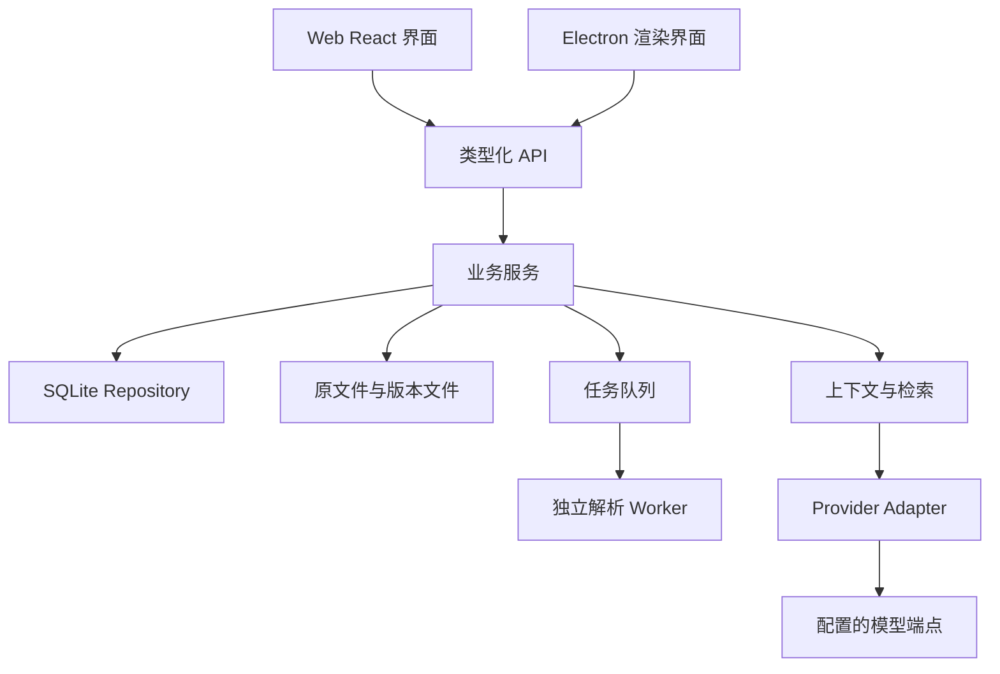

# 溯页 · 从零搭建方案 v1

> 编写日期：2026-10-02。
>
> 适用范围：个人、非商业用途的英文论文阅读与学习工具，优先本地运行，兼顾网页版与 Windows 桌面版。
>
> 本文是新项目的产品与技术建议。页面、实体、接口和阶段安排均为拟定方案，不代表已经实现。旧项目的能力与问题可作为参考，但新版按本文重新建立边界和契约。

## 目录

1. [总体建议](#1-总体建议)
2. [产品定位与学习流程](#2-产品定位与学习流程)
3. [页面与交互设计](#3-页面与交互设计)
4. [阅读器与文档处理](#4-阅读器与文档处理)
5. [学习功能设计](#5-学习功能设计)
6. [AI 对话、翻译与 Provider](#6-ai-对话翻译与-provider)
7. [笔记、标注与复习](#7-笔记标注与复习)
8. [视觉规范与共享组件](#8-视觉规范与共享组件)
9. [技术架构与模块职责](#9-技术架构与模块职责)
10. [数据模型与来源契约](#10-数据模型与来源契约)
11. [接口与状态设计](#11-接口与状态设计)
12. [数据可靠性与运行方式](#12-数据可靠性与运行方式)
13. [阶段计划与验收标准](#13-阶段计划与验收标准)
14. [旧数据迁移与开工准备](#14-旧数据迁移与开工准备)
15. [决策记录与参考资料](#15-决策记录与参考资料)

---

## 1. 总体建议

新版首先建立三个基础：

1. **可靠的原 PDF 阅读。** 文献导入后尽快能阅读；复杂解析在后台完成。
2. **统一的来源与学习记录。** 原文、解释、译文、标注和笔记能够互相定位。
3. **按完整使用流程交付。** 每个阶段都形成一个可实际使用的产品版本。

建议的第一条完整流程：

**打开论文 → 选择原文 → 获得解释 → 回到出处 → 保存学习记录 → 再次找到记录。**

这条流程稳定后，再深化论文主线、方法拆解、图表理解与复习。

### 1.1 关键取舍

| 问题 | 新版建议 | 原因 |
| --- | --- | --- |
| 默认阅读方式 | 原 PDF | 保留原始图表、公式、编号与排版 |
| 文本重排 | 后续增强模式 | 需要结构质量和真实版式样本支持 |
| 右侧工具 | 理解原文、论文问答、上下文翻译 | 减少一级入口，同时保留完整任务 |
| 论文主线 | 可收起导航与阶段任务 | 引导阅读，不持续占用大块屏幕 |
| 数据存储 | SQLite，明确实体与版本 | 方便查询、事务、迁移和恢复 |
| 运行方式 | 本地业务服务，Web 与桌面共用 | 个人使用方便，减少重复业务代码 |
| 检索 | 全文关键词检索起步 | 易检查、易维护，后续按效果加入语义检索 |
| AI 接入 | Provider + 能力声明 + 统一上下文 | 防止协议和上下文逻辑散落 |
| 解析 | 独立 Worker + Parser Adapter | 限制资源占用，允许替换引擎 |
| 开发顺序 | 数据与阅读 → AI 闭环 → 学习成果 → 增强解析 | 先验证实际价值和可靠性 |

## 2. 产品定位与学习流程

### 2.1 定位

**溯页是一款围绕英文原文、证据核对和个人理解建立学习记录的论文阅读工具。**

核心目标：帮助使用者讲清楚研究问题、方法、发现、支撑证据与结论边界。

### 2.2 使用者

- 希望理解英文论文的学生。
- 需要反复核对研究方法和统计结果的研究生。
- 阅读大量文献、需要长期整理记录的个人研究者。
- 为课程汇报、组会和写作准备证据的人。

### 2.3 学习闭环


### 2.4 功能评价原则

每个功能需要明确：

1. 帮助使用者完成哪一步。
2. 处理哪些原文或数据。
3. 产生什么结果。
4. 结果如何留存、搜索和回到来源。
5. 失败时如何继续工作。

进度条、介绍卡和统计数字只有在帮助行动时才出现。理解程度由可解释的学习记录体现，阅读时间和点击次数不自动代表掌握程度。

## 3. 页面与交互设计

### 3.1 三个主页面

| 页面 | 主要职责 | 主要动作 |
| --- | --- | --- |
| 我的论文 | 选择与管理阅读对象 | 导入、分组、搜索、打开、恢复 |
| 阅读工作区 | 原文阅读、理解与核对 | 选择、提问、翻译、标注、返回出处 |
| 学习笔记 | 长期整理与复习 | 搜索、编辑、回看、导出、复述 |

设置使用独立面板或对话框，避免成为阅读时持续占用空间的栏目。

### 3.2 我的论文

建议包含：

- 全部论文、自建分组、最近阅读、回收站。
- 标题与文件名搜索。
- PDF 导入和任务状态。
- 每篇论文的标题、页数、上次位置、记录数量。
- 新建分组弹窗与分组管理。
- 移动、删除、恢复等操作菜单。

宽屏为分组侧栏加文献列表；窄屏将分组收纳为一个自写选择器。

文献主内容区域负责打开阅读，次要操作不抢占标题空间。重复文件通过文件哈希检测，给出“打开已有文献”或“明确创建副本”的选择。

### 3.3 阅读工作区

```text
┌─────────────────────────────────────────────────────────┐
│ 论文标题                   搜索 / 页码定位 / 设置 / 更多 │
├─────────────┬─────────────────────────┬─────────────────┤
│ 可收起导航  │                         │ [当前工具 ▾]    │
│             │                         │ 按需工具操作    │
│ 章节目录    │       原 PDF             ├─────────────────┤
│ 学习主线    │                         │ 当前选区/上下文 │
│ 图表索引    │                         │                 │
│             │                         │ 任务内容        │
│             │                         │                 │
│             │                         │ 输入与保存      │
└─────────────┴─────────────────────────┴─────────────────┘
```

行为要求：

- 左侧导航可收起。
- 中间阅读区与右侧助手可调宽度。
- 助手顶部只有一行工具栏。
- 对话模式才显示新建和历史操作。
- 原文与助手各自滚动，避免消息列表再嵌套一套主滚动条。
- 论文主线、图表索引通过导航进入，不再增加一排大按钮。
- 图表、方法等任务可以在“理解原文”内切换内容上下文。
- 当前论文笔记按需展开，复用独立笔记页组件。

### 3.4 三个助手工具

| 工具 | 工作内容 | 默认上下文 |
| --- | --- | --- |
| 理解原文 | 拆句、术语、自述核对、图表理解、阶段学习 | 当前选区或指定学习任务 |
| 论文问答 | 自由提问、追问、全文检索、对话历史 | 当前论文；可切为普通对话 |
| 上下文翻译 | 选段翻译、术语匹配、人工修订 | 选区及相邻语境 |

工具切换保留论文位置及各工具草稿。当前范围通过简短状态显示，避免重复介绍卡。

### 3.5 移动端

- 使用“原文 / 助手”切换，一次显示一个主要面板。
- 导航作为抽屉打开。
- 输入区处理软键盘与安全区域。
- 图表、公式在局部允许放大或横向滚动。
- 来源跳转进入原文，保留返回助手的位置。

### 3.6 页面地址与刷新

首版为兼容 GitHub Pages 和桌面静态资源，建议使用 Hash 路由，例如：

```text
#/library
#/papers/{paperId}/read
#/notes
```

地址保存页面及论文身份；具体页码、工具和滚动状态由阅读会话恢复。以后若改为路径路由，部署层必须配置正确的单页应用回退，并让 API 的真实 404 保持为 API 错误。

## 4. 阅读器与文档处理

### 4.1 默认原 PDF 阅读

建议基于 PDF.js 成熟 Viewer 能力包装产品交互：

- 连续滚动与页面定位。
- 文字层与文字选择。
- PDF 目录和内部链接。
- 缩放、旋转。
- 可见页优先渲染及有限缓存。
- 高亮与区域标注。

顶部保留唯一页码定位入口，避免顶部与底部各一套翻页按钮。原页文字大小通过缩放调整；重排模式的字号设置另行管理。

PDF.js 官方说明 Viewer 层可以作为自定义阅读器起点。[PDF.js 官方介绍](https://mozilla.github.io/pdf.js/getting_started/?lang=en)

### 4.2 三种就绪状态

| 状态 | 可用能力 | 失败影响 |
| --- | --- | --- |
| 原文件就绪 | 查看 PDF、区域标注 | 文件无法打开时需重新导入 |
| 文字索引就绪 | 搜索、选段理解、全文检索 | 原页仍可阅读，显示索引状态 |
| 结构解析就绪 | 章节主线、图表关系、文本精读 | 原页及已有文字能力仍保留 |

导入不等待所有增强解析结束。任务分阶段持久化，界面显示实际完成状态。

### 4.3 选区与区域

文字型 PDF 使用文字选区与坐标；没有文字层的页面允许区域选择。

区域选择保存原页矩形。若需要 OCR 或视觉模型识别，应明确表示识别文字的来源，不能将未经核对的识别结果伪装成原 PDF 已验证的文字。

选择内容后出现少量任务入口：理解、翻译、提问、标注。它们共用一个来源对象。

### 4.4 跳转与返回

跳转前保存论文、页码、视图、缩放、旋转和滚动位置。

- 精确文字或区域匹配成功：高亮来源。
- 只能确认页面：打开该页并提示定位范围。
- 文献已移除：显示缺失状态，支持恢复或重新关联。
- 完全无法确认：不跳到相似但无关的段落。

刷新后在 PDF 页面就绪时恢复位置，加载中不写入 0 位置。

### 4.5 文本精读增强模式

后续提供：

- 标题、作者、机构、摘要、章节、正文、图注、参考文献分级。
- 字号、字体、行高、宽度调整。
- 正文数字采用 Times New Roman，可信上下标按原文恢复。
- 图表原页裁切内嵌。
- 低质量块提示及人工校对。
- 随时返回原页。

该模式应保留可追溯的块位置和解析版本，不直接将一页扁平文字当作完整语义结构。

### 4.6 解析引擎

定义统一 Parser Adapter，输出页面、结构块、图表、位置、质量和警告。

候选路径：

1. PDF.js 文字层与基础索引。
2. 本地布局提取引擎，用于字体、阅读顺序和结构识别。
3. 可选 Docling 等模型解析，用于更复杂的布局与表格。
4. 可选 OCR，用于扫描件。

Docling 提供结构树、阅读顺序和位置等文档信息，适合转换到统一模型。是否采用应由样本效果、资源占用与打包验证决定。[Docling 文档模型](https://docling-project.github.io/docling/concepts/docling_document/)

任何引擎都不能预先承诺所有论文正确。复杂表格、公式和跨栏结构优先保留原页核对路径。

## 5. 学习功能设计

### 5.1 段落理解

流程：

1. 选择英文原文。
2. 填写自己的理解，或者提出具体困难。
3. 获得提示、句子拆解或理解核对。
4. 打开依据核实。
5. 修订理解。
6. 保存记录与仍不确定的地方。

核对理解要求先有自述；普通解释允许直接请求。工具不强迫所有使用者在每次提问前填写长表单。

### 5.2 反馈结构

建议核对结果包含：

- 理解正确的部分。
- 遗漏的限定条件。
- 与原文不一致的内容。
- 支撑反馈的出处。
- 一个促进重新思考的问题。

学生文本和 AI 文本独立保存。AI 修改不覆盖学生自述。

### 5.3 六阶段主线

| 阶段 | 要回答的问题 | 学习成果 |
| --- | --- | --- |
| 背景 | 研究什么现象，为什么重要？ | 背景复述与来源 |
| 不足 | 前人尚未解释什么？ | 具体不足及依据 |
| 问题 | 作者检验什么问题或假设？ | 问题、变量和限定范围 |
| 方法 | 对谁、怎样测量、怎样分析？ | 方法卡及设计理由 |
| 发现 | 数据支持什么结果？ | 发现与证据对应 |
| 贡献与局限 | 作者如何解释，边界是什么？ | 贡献、局限、待核实项 |

主线是当前论文的导航与任务入口。自动提取结果先标为候选，使用者确认后才成为自己的学习成果。规则或 AI 生成的摘要不能自动表示学生已经掌握。

### 5.4 方法卡

五项：样本、情境与流程、测量、数据处理、分析方法。

每项保存：

```text
学生理解
作者描述
原文证据
为什么这样设计
仍不确定的问题
确认状态
```

方法字段需要适应不同研究类型。没有报告的信息显示“未找到”或“作者未明确说明”，不补造细节。

### 5.5 图表理解

图表任务输入包括：原图裁切、图题、相关方法、结果与讨论。

引导使用者辨认：

- 变量、单位、组别和图例。
- 变化趋势、差异和不确定性。
- 数据直接显示的内容。
- 作者的解释。
- 自己的判断与疑问。

多面板图先显示完整原图，面板级关联后续增强。手工裁切保持原页坐标与版本。

### 5.6 发现与证据

每条主要发现建议包含：

- 使用者对发现的复述。
- 数据结果与数值条件。
- 结果段落、图表和页码。
- 作者解释。
- 研究设计与适用边界。
- 不确定项。

相关或回归结果不能单独作为因果判断。引用存在也不等于引用支持该判断，需要回看语义和研究设计。

## 6. AI 对话、翻译与 Provider

### 6.1 上下文范围

| 范围 | 场景 | 提供给模型的材料 |
| --- | --- | --- |
| 当前选区 | 拆句、术语、局部翻译 | 选区及必要邻近语境 |
| 当前章节 | 方法流程、讨论逻辑 | 章节中检索的相关内容 |
| 当前论文 | 全文问题、主线梳理 | 跨章节检索的证据 |
| 普通对话 | 不关联论文的自由问题 | 问题与历史 |

界面显示当前范围与论文身份。全文关联表示检索覆盖全文，不表示全文每段都发送给模型。

### 6.2 统一上下文构建

所有 AI 任务通过同一个 Context Builder：

```text
任务与问题
  → 确定上下文范围
  → 获取论文、选区和章节
  → 匹配已确认术语
  → 检索与选择证据
  → 分配输入和输出预算
  → 创建供应商无关请求
```

预算按模型能力和 token 估计设置；字符限制作为额外防护。上下文超限时减少历史或证据，并说明覆盖范围。

### 6.3 检索策略

首版采用 SQLite FTS5、关键词扩展和章节加权。

- 具体问题优先检索对应章节。
- 整体问题按背景、问题、方法、结果、讨论分配来源。
- 首轮证据不足时允许有限的补充检索。
- 来源去重，但保留必要的上下文。
- 后续根据检索验收结果决定是否增加本地语义检索。

FTS5 提供 BM25、摘要与匹配高亮，可作为基础检索能力。[SQLite FTS5 文档](https://www.sqlite.org/fts5.html)

### 6.4 Provider

配置包括名称、协议、端点、模型、密钥与能力。

```ts
type ProviderCapabilities = {
  streaming: boolean;
  vision: boolean;
  structuredOutput: boolean;
};

interface AIProvider {
  capabilities: ProviderCapabilities;
  generate(request: AIRequest, signal?: AbortSignal): Promise<AIResult>;
  stream(request: AIRequest, signal?: AbortSignal): AsyncIterable<AIEvent>;
}
```

以上为拟定接口，`AIRequest`、`AIResult`、`AIEvent` 在共享契约中定义。

首个适配器支持一个明确的 OpenAI 兼容协议，完成端到端验证后再扩展。模型能力声明与实际连接检查结合，不能默认所有兼容端点都支持图像或结构化输出。

### 6.5 图像能力

支持视觉时，图表理解发送裁切图片、图题和相关正文。纯文本模型只解释已有文字描述，并注明依据范围。

发送原图或更多论文内容需要与使用者选择的任务范围一致，界面清楚显示将关联的材料。

### 6.6 对话历史

- 对话自动保存，支持内容搜索。
- 消息保留生成时的论文身份和引用。
- 切换论文不改写已有消息的关联。
- 输入草稿按对话保存。
- 停止或失败后保留部分结果并标状态。
- 收藏回答显式选择笔记归属；未关联论文的普通回答不自动附着到任意论文第一页。
- 长历史可形成带出处的摘要，原历史保持可回看。

### 6.7 上下文翻译

翻译选区，同时提供标题、章节、邻近文字和确认术语。输出保留限定词、变量、数值与引用编号。

译文保存：AI 原始结果、人工修订、来源、目标语言、Provider、Prompt 版本与上下文指纹。相同条件恢复缓存，重新生成由使用者主动发起。

人工编辑先存草稿再同步，保存状态可见。相邻段落变化、术语变化或解析版本变化时，缓存身份相应变化。

### 6.8 引用与内容显示

服务端分配引用 ID，回答只映射已提供的来源；未知引用标为未核实。

Markdown 使用受控渲染，支持表格、列表、代码和公式。长公式在局部滚动，错误公式保留可读内容；不直接执行模型输出的 HTML 或脚本。

## 7. 笔记、标注与复习

### 7.1 历史与主动保存

| 记录 | 用途 | 保存方式 |
| --- | --- | --- |
| 对话/段落历史 | 回看交互、继续提问 | 自动保存 |
| 个人理解 | 留下自己的解释 | 主动保存 |
| AI 收藏 | 保存有用回答或译文 | 主动收藏 |
| 原文标注 | 标记重要原文 | 用户创建 |
| 术语 | 确认词义与译法 | 用户保存并确认 |

AI 解释几十个段落时，历史仍可追溯；笔记保留经过使用者挑选的成果。

### 7.2 大量记录的组织

- 按论文归档。
- 按章节、学习阶段、类型和标签过滤。
- 摘要先展示，详情展开。
- 分页或增量加载。
- 搜索包含论文标题、原文、个人内容、AI 内容与标签。
- 单击出处打开来源并提供返回。

初期所有笔记归属论文；跨论文整理通过标签与搜索实现。

### 7.3 编辑与删除

编辑即时保存本地草稿，延迟同步正式记录；显示保存中、已保存、待同步或冲突。

删除提供撤销和回收站。删除论文时关联记录整体进入回收站；恢复后保持原有 ID 与来源关系。永久删除单独确认。

### 7.4 复述卡

按六阶段汇总学生已确认记录，并保留关键来源：

1. 背景与不足。
2. 问题与假设。
3. 方法及设计理由。
4. 发现与证据。
5. 作者解释、贡献与局限。
6. 待核实事项。

缺失部分明确留空。复习支持隐藏已有理解，先复述后对照；复杂调度系统在实际使用有需要后再加入。

### 7.5 导出

首版提供单篇 Markdown 导出，包含来源、页码、标签、理解、AI 收藏和术语。

完整数据备份独立于笔记导出，保证论文文件、版本、数据库与设置可以恢复。

## 8. 视觉规范与共享组件

### 8.1 阅读友好

| 场景 | 建议 |
| --- | --- |
| 页面标题 | 24–28 px |
| 区域标题 | 18–20 px |
| UI 常规文字 | 14–16 px |
| AI 正文 | 16–18 px，行高约 1.7 |
| 文本精读 | 默认 18 px，后续支持可调 |
| 重要状态与错误 | 至少常规 UI 字号，不藏在极小文字中 |

PDF 文字层、公式和上下标使用各自排版逻辑，不被统一字号规则粗暴覆盖。

### 8.2 自写组件

建立共享组件：

- Button、IconButton。
- SelectMenu。
- Dialog、ConfirmDialog。
- TextField、TextArea。
- SourceLink、SourcePreview。
- NoteCard、MessageCard。
- EmptyState、ErrorState、LoadingState。
- SaveStatus、TaskProgress。

所有下拉框统一自写样式与 API。组件需要明确键盘操作、焦点、禁用、加载与可访问名称，而不只统一外观。

### 8.3 按需呈现

- 新对话时展示一个简洁示例。
- 有内容后撤去空状态说明。
- 当前图表优先显示原图与完整图题。
- 历史、细节、提示放入折叠或面板。
- 高价值操作靠近内容。
- 生成、保存、解析错误显示在发生的位置，并保留输入。

## 9. 技术架构与模块职责

### 9.1 模块化单体



这些模块可以位于同一仓库，由同一个本机 API 服务运行。

### 9.2 推荐技术

| 层次 | 建议 |
| --- | --- |
| 前端 | React、TypeScript、Vite |
| 阅读 | PDF.js Viewer 能力封装 |
| 富文本显示 | Markdown、GFM、数学公式渲染 |
| 后端 | Node.js、明确路由与业务服务 |
| 存储 | SQLite、事务、版本化迁移 |
| 检索 | FTS5，检索 Adapter 预留扩展 |
| 解析 | Worker 与可替换 Parser Adapter |
| 桌面 | Electron，共用前端与 API |

依赖版本在开工时锁定并检查兼容性，避免仅按最新版本号组合。

### 9.3 目录建议

```text
apps/
  web/                 页面、路由、功能组件
  desktop/             窗口、启动、退出、更新入口

packages/
  contracts/           类型、请求校验、事件契约
  ui/                  共享组件与视觉变量
  core/                文献、学习、笔记业务
  server/              HTTP、存储、文件、任务
  document/            解析适配、来源、版本
  ai/                  Provider、Prompt、上下文、检索

docs/
  product/             产品流程与原型
  architecture/        决策与接口
  acceptance/          样本与验收记录
```

目录按实际代码逐步建立，不创建没有职责的空层。

### 9.4 状态分工

| 状态 | 管理位置 |
| --- | --- |
| 文献、笔记、消息等持久实体 | 服务端数据库 |
| 查询缓存、加载与刷新 | 前端统一查询层 |
| 当前工具、弹窗、面板宽度 | UI 状态 |
| 页码、缩放、来源返回位置 | 阅读会话 |
| 未保存编辑 | 草稿机制 |
| 生成与解析 | 明确状态机 |

前端入口只编排路由与全局初始化，各功能通过接口和事件协作。

## 10. 数据模型与来源契约

### 10.1 主要实体

| 实体 | 关键内容 |
| --- | --- |
| Paper | 文献 ID、文件身份、标题、作者、分组、删除状态 |
| DocumentVersion | 引擎、版本、质量、解析时间 |
| Section | 标题、层级、块范围与来源 |
| Block | 文字、样式、顺序、页与位置 |
| Figure | 原图位置、图题、相关块、手工裁切 |
| SourceAnchor | 文件、版本、页、引文、坐标 |
| Annotation | 标注、颜色、来源与备注 |
| Note | 类型、个人内容、AI 内容、标签与出处 |
| LearningRecord | 阶段、方法、发现、确认与疑问 |
| Conversation / Message | 对话、消息、上下文、生成状态 |
| GlossaryEntry | 术语、确认译法、解释和来源 |
| ProviderProfile | 协议、端点、模型、能力、密钥引用 |
| Draft / ReadingSession | 编辑防丢与阅读恢复 |
| Job | 阶段、进度、重试与错误 |

业务实体分表，结构复杂的附加属性可以采用 JSON 字段；避免每次编辑笔记都读取和写回整个项目快照。

### 10.2 SourceAnchor

拟定结构：

```ts
type SourceAnchor = {
  id: string;
  paperId: string;
  fileHash: string;
  documentVersionId?: string;
  pageIndex: number;
  blockId?: string;
  quote?: { exact: string; prefix?: string; suffix?: string };
  rects?: Array<[number, number, number, number]>;
  origin: 'pdf-text' | 'pdf-region' | 'ocr' | 'corrected-text';
};
```

- 页索引从 0 开始，界面转换为从 1 开始的页码。
- 坐标使用未旋转原页、左上角原点的归一化矩形。
- 区域锚点可以没有文字。
- OCR 与校对文本保留来源性质，不与原 PDF 文字校验混淆。
- 重解析迁移保存映射和匹配状态，旧锚点不静默改变。

### 10.3 关系与归属

一篇论文可以有多个解析版本、多条标注和笔记；一条笔记可以有多个来源；消息可关联论文并包含多个证据。

笔记记录学生内容、AI 原始内容和修订内容，避免覆盖。对话收藏使用消息 ID 做幂等依据。

### 10.4 版本与冲突

- 可编辑实体具有 `revision` 与 `updatedAt`。
- 写入携带预期版本。
- 冲突返回明确错误，保留本地编辑。
- 不同字段是否自动合并，由业务规则决定。
- 草稿记录所属实体和基础版本。
- 已删除记录不被晚到生成结果重新创建。

## 11. 接口与状态设计

以下为新版拟定接口，不是旧项目现有接口清单。

### 11.1 接口分组

| 分组 | 示例 |
| --- | --- |
| 文献 | `GET/POST /api/v1/papers` |
| 文件与状态 | `GET /api/v1/papers/:id/file`、`GET /api/v1/papers/:id/status` |
| 分组 | `GET/POST /api/v1/groups` |
| 解析 | `POST /api/v1/papers/:id/extractions` |
| 结构 | `GET /api/v1/papers/:id/sections`、`GET /api/v1/papers/:id/figures` |
| 搜索 | `GET /api/v1/papers/:id/search` |
| 任务 | `GET /api/v1/jobs/:id`、`POST /api/v1/jobs/:id/cancel` |
| 学习 | `GET/PUT /api/v1/papers/:id/learning` |
| 标注 | `GET/POST /api/v1/papers/:id/annotations` |
| 笔记 | `GET/POST /api/v1/notes`、`PATCH /api/v1/notes/:id` |
| 对话 | `GET/POST /api/v1/conversations` |
| 消息 | `POST /api/v1/conversations/:id/messages` |
| 翻译 | `POST /api/v1/translations`、`PATCH /api/v1/translations/:id` |
| 供应商 | `GET/POST /api/v1/providers`、`POST /api/v1/providers/:id/test` |
| 草稿与会话 | `PUT /api/v1/drafts/:id`、`PUT /api/v1/reading-sessions/:paperId` |
| 恢复与导出 | 回收站、备份任务、单篇导出 |

请求与响应通过共享契约校验。列表采用分页或游标，详情按需获取，不一次传输全部论文正文。

### 11.2 AI 请求

```json
{
  "task": "paper-question",
  "content": "为什么作者采用这种分析方法？",
  "context": {
    "scope": "paper",
    "paperId": "example-paper",
    "anchorIds": []
  },
  "providerId": "example-provider",
  "stream": true,
  "requestId": "example-request"
}
```

ID 为结构示意。服务端验证文献、锚点和任务权限，再构建上下文，不直接信任客户端附带的任意论文文本。

### 11.3 生成状态

```text
准备 → 检索 → 请求模型 → 输出中 → 完成
                     ├→ 已停止
                     └→ 失败
```

流式事件建议采用 NDJSON，明确区分开始、阶段、文字增量、来源、完成和错误。事件包含消息 ID；停止后保留部分内容，收藏时标明内容完整性。

### 11.4 解析状态

```text
已保存文件 → 排队 → 建立文字索引 → 结构解析 → 完成
                   ├→ 部分完成
                   ├→ 已取消
                   └→ 失败
```

进度显示实际页数和阶段；未知耗时不显示伪精确剩余秒数。重启后的任务明确标记中断，后续有检查点后再支持续跑。

### 11.5 错误契约

```json
{
  "code": "SOURCE_NOT_VERIFIED",
  "message": "无法确认这段文字与所选来源一致，请重新选择或打开原页。",
  "retryable": false,
  "requestId": "example-request"
}
```

只读查询可以有限重试；导入、收藏、删除等写请求使用幂等机制。保存失败不清空输入。

## 12. 数据可靠性与运行方式

### 12.1 草稿

所有编辑型内容采用统一机制：

1. 即时写本地草稿。
2. 延迟提交服务端。
3. 成功后更新保存状态。
4. 失败后保留待同步内容。
5. 恢复时比较实体版本，冲突展示两份内容。

译文、笔记、学习理解、对话输入都接入该机制。

### 12.2 数据备份

完整备份包含数据库、原文件、版本和必要设置。建立一致快照或暂停写入后打包；不能在运行中只复制 SQLite 主文件并假定已完整。

备份清单记录版本、文件数量和哈希。恢复先校验、再导入，失败保留原数据。

密钥默认不以解密形式导出；跨机器迁移允许重新配置供应商，或另行设计用户密码保护的导出格式。

### 12.3 本地运行

- Web 开发通过本机 API。
- 桌面复用同一前端与业务服务。
- 桌面本机服务绑定回环地址，使用会话鉴权并验证来源。
- 桌面退出正常关闭任务与数据库。
- 用户数据位于用户目录，不位于安装目录。
- 原文件与数据库路径只由受控服务解析。

### 12.4 桌面隔离

渲染进程启用上下文隔离和沙箱，不暴露通用文件系统或任意进程执行接口。外部链接与窗口导航采用明确规则。[Electron 安全建议](https://www.electronjs.org/docs/latest/tutorial/security)

### 12.5 外部 AI 与 Web 部署

本地保存不等于本地推理。调用远程 Provider 时，相应选区、图片、检索内容和历史会发送到配置端点，界面显示关联范围。

如果后续使用 GitHub Pages 加远程 API，需要认证、HTTPS 和正确跨域设置。前端构建产物不包含 Key；公网 API 的用户隔离与认证应在公开部署前完成。

## 13. 阶段计划与验收标准

### 13.1 阶段一：可靠阅读底座

交付：

- 项目结构、共享类型和视觉基础。
- 文献导入、分组、搜索、重复识别。
- 原 PDF、目录、选择、高亮。
- 阅读位置与草稿恢复。
- SQLite、回收站、基础备份恢复。
- Web 与桌面开发启动通道。

验收：关闭、刷新、重新打开后，文献、位置和标注保持正确；索引失败仍能查看原 PDF；删除可以恢复。

### 13.2 阶段二：完整 AI 学习流程

交付：

- 首个 Provider 和连接检查。
- 选段理解、自述核对。
- 上下文翻译。
- 全文问答、历史、流式、停止。
- 引用跳转和返回。
- 回答收藏、笔记编辑与导出。

验收：学习一篇真实论文，所有关键回答和笔记都能回到出处；停止、失败、断网和刷新不丢编辑内容；普通对话不误附加论文。

### 13.3 阶段三：结构化学习成果

交付：

- 六阶段导航。
- 方法五项卡。
- 图表任务。
- 发现与证据记录。
- 术语确认和译法约束。
- 论文复述卡。

验收：使用者可根据自己确认的记录讲清问题、方法、发现和局限；缺失内容与候选内容可区分。

### 13.4 阶段四：增强解析与长期使用

交付：

- 多版式解析评估。
- 文本精读模式。
- 人工校对、版本比较与迁移。
- 大量论文、消息、笔记的性能优化。
- Windows 安装与升级验证。

验收：复杂格式有回退路径；重新解析不静默改变旧证据；升级不覆盖用户数据；长列表加载与搜索可用。

### 13.5 后续扩展

按真实需求评估：跨论文比较、本地语义检索、OCR 资源包、文献管理工具交换、复习计划、同步和自动更新。

### 13.6 真实论文验收集

建议从约 10–15 篇有代表性的论文开始，覆盖：

- 单栏和双栏。
- 长作者及机构列表。
- 矢量图、多面板图、复杂表格。
- 大量公式和上下标。
- 扫描件。
- 附录、补充材料和长参考文献。

分别记录阅读顺序、标题层级、字符、图注、裁切与来源定位错误。样本未标注完成前，不公布整体解析准确率。

本节定义未来验收工作，不表示已经运行这些检查。

## 14. 旧数据迁移与开工准备

### 14.1 旧数据

新项目通过迁移入口处理原论文、笔记、标注、术语和对话：

- 迁移前创建完整备份。
- 保留旧 ID 或建立明确映射。
- 保留原文件哈希和旧来源信息。
- 无法转换的来源标为待核对。
- 供应商凭据按新存储方式重新保护，必要时重新输入。
- 核对各实体数量及文件存在性。
- 不以重新解析替代原笔记迁移。

旧源码可作为行为与问题参考，复用时先明确模块契约，避免把原有大入口直接带入新版。

### 14.2 开工前四份规格

| 规格 | 内容 | 完成标准 |
| --- | --- | --- |
| 核心流程 | 导入、阅读、理解、核对、保存、返回 | 正常与失败分支明确 |
| 工作区原型 | 宽屏、窄屏、空状态、加载状态 | 每个控件都有具体任务 |
| 数据与接口 | 来源、草稿、版本、消息、笔记归属 | 前后端遵守同一契约 |
| 验收集 | 真实论文与关键操作 | 可记录问题并重复检查 |

开工后的第一条纵向实现：一篇论文导入与打开 → 一个原文选区 → 一个解释任务 → 一个来源跳转 → 一条可恢复的学习记录。

## 15. 决策记录与参考资料

### 15.1 本版确定的建议

1. 三个主页面，阅读工作区作为核心。
2. 原 PDF 默认阅读，结构化文本作为增强。
3. 导入分阶段就绪。
4. 右侧一行工具栏、三个主要工具。
5. 所有学习内容共用来源锚点。
6. Provider 与上下文构建分别负责协议和任务材料。
7. SQLite 实体存储，明确版本与冲突。
8. 草稿、回收站和备份进入基础交付。
9. Web 与桌面共用业务，桌面从起步具备运行通道。
10. 每阶段通过真实论文的完整流程验收。

### 15.2 仍需样本或原型验证的事项

- 分栏宽度、窄屏交互和连续滚动体验。
- 首个兼容 Provider 的实际协议和能力。
- 增强解析引擎、模型资源与 OCR 打包方式。
- 结构识别质量与人工校对成本。
- 各模型预算及长对话摘要策略。
- 文本精读何时达到可作为主要阅读方式的质量。

### 15.3 参考资料

- PDF 阅读器分层与 Viewer 起点：[PDF.js 官方说明](https://mozilla.github.io/pdf.js/getting_started/?lang=en)。
- 结构树、表格、阅读顺序与位置：[Docling 文档模型](https://docling-project.github.io/docling/concepts/docling_document/)。
- 全文排序与匹配摘要：[SQLite FTS5](https://www.sqlite.org/fts5.html)。
- 桌面隔离、权限与窗口行为：[Electron 安全指南](https://www.electronjs.org/docs/latest/tutorial/security)。
- 若继续使用 PyMuPDF，应在选型和分发时核对其 AGPL/商业许可要求：[PyMuPDF 官方许可说明](https://pymupdf.io/licensing)。

个人非商业用途不自动免除依赖许可要求。具体版本、资源和分发方式在开工时形成依赖清单。

旧项目功能盘点可参考 [产品功能与设计方案](产品功能与设计方案.md)，但新版实施优先遵循本文确定的流程、来源与模块边界。

---

## 最终建议

先交付一个能让使用者放心反复阅读、核对和留存的工具，再将方法、图表、发现与复习逐步融入。

每次扩展都应增强这条主线：

**英文原文 → 自己的理解 → AI 辅助 → 证据核对 → 学习记录 → 复述与复习。**
