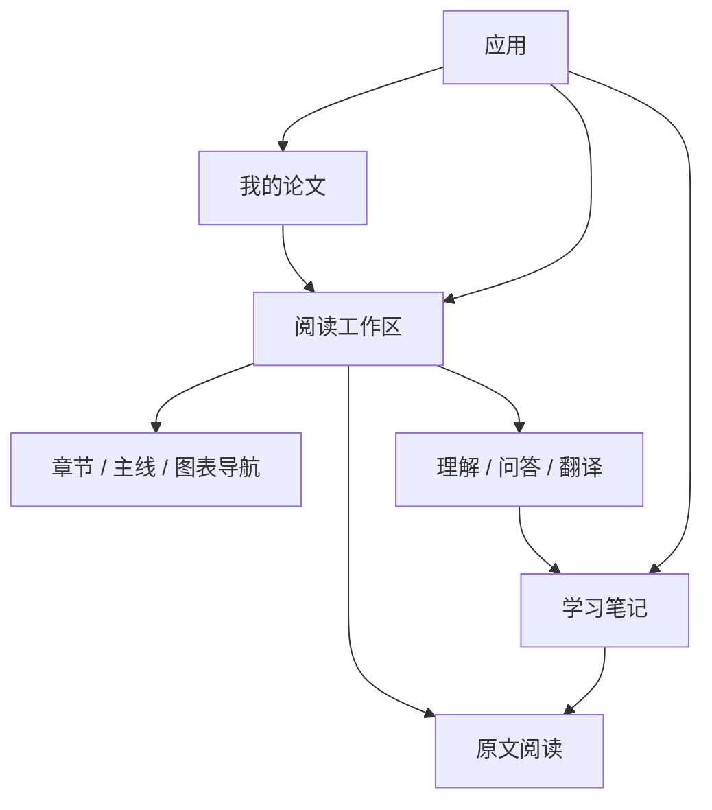
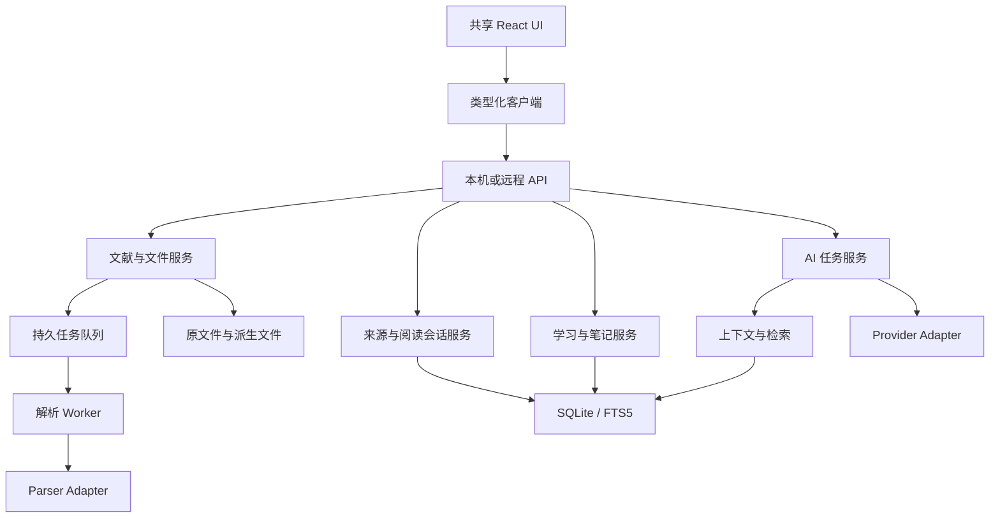

# 论文学习工具 · 独立项目产品与技术实施方案

> 文档版本：1.0
>
> 编写日期：2026-10-02
>
> 项目定位：个人使用、优先本地运行的英文论文阅读与学习工具。
>
> 文档性质：可用于新建仓库、确定产品原型、设计数据与接口、组织开发和验收的独立方案。全文描述拟建设能力；代码示例用于说明契约，尚未作为完整应用实现或运行验证。

## 使用说明

本文分清三类信息：

- **项目决策**：本项目建议采用的产品或技术方案。
- **外部事实**：在官方文档或项目仓库中核实的能力，附来源链接。
- **待验证项**：需要原型、真实论文或目标机器验证后才能确定的参数与选型。

项目名称、Logo 和安装包名称在品牌设计阶段确定，本文使用“论文学习工具”作为工作名称。

## 目录

1. [产品定义](#1-产品定义)
2. [参考项目与借鉴方法](#2-参考项目与借鉴方法)
3. [产品功能与信息架构](#3-产品功能与信息架构)
4. [页面与交互方案](#4-页面与交互方案)
5. [学习任务与成果](#5-学习任务与成果)
6. [技术选型与架构](#6-技术选型与架构)
7. [前端模块与状态管理](#7-前端模块与状态管理)
8. [PDF 阅读器实现](#8-pdf-阅读器实现)
9. [文档导入与解析实现](#9-文档导入与解析实现)
10. [来源定位与版本实现](#10-来源定位与版本实现)
11. [图表与文本精读实现](#11-图表与文本精读实现)
12. [全文检索与上下文构建](#12-全文检索与上下文构建)
13. [AI Provider 与流式实现](#13-ai-provider-与流式实现)
14. [翻译与术语实现](#14-翻译与术语实现)
15. [笔记与编辑器实现](#15-笔记与编辑器实现)
16. [数据库与事务设计](#16-数据库与事务设计)
17. [API 与事件契约](#17-api-与事件契约)
18. [后台任务、错误与并发](#18-后台任务错误与并发)
19. [桌面、Web 与数据备份](#19-桌面web-与数据备份)
20. [视觉规范与组件](#20-视觉规范与组件)
21. [开发阶段与验收](#21-开发阶段与验收)
22. [性能目标、风险与决策记录](#22-性能目标风险与决策记录)
23. [开工清单与参考资料](#23-开工清单与参考资料)

---

## 1. 产品定义

### 1.1 定位

**帮助使用者围绕英文原文形成理解，核对证据，并留存可复习的学习成果。**

首要使用者是学生、研究生和长期阅读文献的个人研究者。

### 1.2 核心流程


### 1.3 产品成功标准

1. 能讲清论文的研究问题、方法、发现和局限。
2. 能为主要判断找到原文或图表依据。
3. 能区分数据结果、作者解释和自己的推断。
4. 多次使用后仍能找到阅读位置和学习记录。
5. 无 AI 或增强解析失败时仍能阅读、标注和整理。

这些是评价目标，不预设自动计算“理解分数”。

### 1.4 交付范围

- Web 与 Windows 桌面共用产品界面及业务能力。
- 本地保存论文、标注、笔记、对话与术语。
- 支持用户配置远程或本地 AI 端点。
- 首版专注单篇论文学习；跨论文比较作为后续扩展。
- 文献输入首先支持 PDF，其他格式通过 Adapter 留出扩展位置。

## 2. 参考项目与借鉴方法

### 2.1 参考矩阵

| 项目或规范 | 官方资料确认的能力 | 本项目借鉴方式 | 引入方式 |
| --- | --- | --- | --- |
| Zotero | 标注加入笔记，并链接回 PDF 页面 | 让标注、个人理解和引用保持关联 | 借鉴交互与数据思想 |
| PDF.js | PDF 解析、显示与 Viewer 能力 | 建立原页、文字层、目录和检索基础 | 使用依赖，封装 ReaderAdapter |
| Docling | 结构化文档、布局、表格、OCR 与本地运行 | 增强解析使用统一中间模型 | 可选 Parser Adapter |
| RAGFlow | 可查看的分块、可追溯引用、多步检索 | 让检索证据可检查，复杂问题有限补充检索 | 借鉴流程与诊断方式 |
| Open WebUI | 多模型对话、对话组织及知识关联 | 对话历史、模型配置与上下文状态一致 | 借鉴产品交互 |
| Tiptap | 通过 Schema 定义节点、属性和嵌套结构 | 笔记正文中嵌入受控来源节点 | 可选编辑器依赖 |
| W3C Web Annotation | TextQuote 与 TextPosition 等选择器 | 引文、上下文和位置组合定位 | 借鉴来源模型 |
| SQLite FTS5 | 全文匹配、BM25、摘要与高亮 | 单机全文搜索与基础检索 | 使用数据库能力 |

资料来源分别为 [Zotero 阅读器](https://www.zotero.org/support/pdf_reader)、[PDF.js](https://github.com/mozilla/pdf.js)、[Docling](https://github.com/docling-project/docling)、[RAGFlow](https://github.com/infiniflow/ragflow)、[Open WebUI](https://docs.openwebui.com/features/)、[Tiptap Schema](https://tiptap.dev/docs/editor/core-concepts/schema)、[Web Annotation](https://www.w3.org/TR/annotation-model/)、[SQLite FTS5](https://www.sqlite.org/fts5.html)。

表中“借鉴方式”是本项目的设计推导，不能理解为这些项目已经提供本工具所需的完整学习流程。

### 2.2 Zotero：把标注变成可回看的笔记

Zotero 支持将标注加入笔记，并从笔记回到原 PDF 页。[官方说明](https://www.zotero.org/support/pdf_reader)

本项目采用三个独立对象：来源选区、标注、笔记。笔记引用标注或来源 ID，正文不只是复制一段失去身份的文字。

用户可以从原文创建标注、将标注加入笔记、在旁边写理解、再次打开来源。原文引文和用户评论分别保存，避免重复显示或混淆。

### 2.3 PDF.js：复用成熟阅读能力

PDF.js 的 Core、Display、Viewer 层各有职责，官方将 Viewer 作为自定义阅读器的起点。[官方介绍](https://mozilla.github.io/pdf.js/getting_started/?lang=en)

本项目封装 Viewer 生命周期和产品工具栏；PDF 绘制、文字层与内部链接采用其已有机制。所有版本相关调用集中在 ReaderAdapter，升级通过适配层及阅读样本检查。

### 2.4 Docling：保留结构，再生成阅读视图

Docling 提供统一结构化表达和本地执行能力；代码与模型资源的许可证需要分别核对。[官方仓库](https://github.com/docling-project/docling)

本项目将其结果转换成 DocumentIR，而非仅拿 Markdown 字符串作为唯一文档数据。标题、图表、来源位置、阅读顺序和质量信息都进入模型。

### 2.5 RAGFlow：回答和检索过程可检查

RAGFlow 展示分块、可追溯引用和多轮检索能力。[官方仓库](https://github.com/infiniflow/ragflow)

本项目借鉴为：每次问答记录检索范围、候选来源和实际引用；宽泛问题按章节覆盖；证据不足可以补充检索。初期用本地模块实现这些步骤，并以样本判断是否需要复杂编排。

### 2.6 Open WebUI：历史与模型是持续使用能力

Open WebUI 的官方功能包括多模型对话和文件夹、标签等对话组织。[官方功能说明](https://docs.openwebui.com/features/)

本项目保留历史搜索、明确模型身份、对话上下文和生成状态。工具切换不丢草稿，每条消息保持当时关联的论文与证据。

### 2.7 参考与代码复用的边界

每项参考都形成一张技术调研记录：资料地址、核实日期、要解决的问题、拟借鉴做法、依赖及许可证、试验结果。

采用现成依赖时保留版本和许可记录；学习其他项目的设计，不意味着可以直接复制其源码、品牌或资源。个人非商业使用同样需要核对具体分发条件。

## 3. 产品功能与信息架构

### 3.1 功能总览

| 模块 | 首版能力 | 后续增强 |
| --- | --- | --- |
| 文献库 | 导入、分组、搜索、最近阅读、回收站 | 批量操作、元数据交换 |
| 阅读 | 原 PDF、目录、检索、选区、标注、恢复 | 文本精读与更多阅读偏好 |
| 理解原文 | 提示、拆句、术语、自述核对 | 方法卡、图表任务、反馈结构化 |
| 论文问答 | 对话历史、全文检索、引用、停止 | 多篇比较、长历史摘要 |
| 翻译 | 选段、邻近语境、术语、编辑、缓存 | 句级对齐与更多语言 |
| 学习成果 | 六阶段、方法、发现、不确定项 | 复习任务 |
| 笔记 | 个人理解、AI 收藏、标注、搜索、导出 | 自定义来源节点编辑器 |
| 设置 | Provider、阅读偏好、数据目录、备份 | 发布与更新设置 |

### 3.2 三个主页面



### 3.3 一个事实来源

论文身份、页码、选区和返回位置由阅读会话统一管理。目录、图表、AI 引用、笔记的跳转都调用 SourceNavigationService，避免每个功能独立修改页码和滚动。

## 4. 页面与交互方案

### 4.1 文献库

- 宽屏左侧分组、右侧列表；窄屏将分组收纳到菜单。
- 标题为主要入口，文件名、页数、上次位置为辅助信息。
- 移动、删除等放在操作菜单。
- 导入后立即展示文件与后台进度。
- 重复文件通过 SHA-256 识别，允许打开已有文件或明确创建副本。
- 删除默认进入回收站，恢复保持原 ID 与学习记录。

### 4.2 阅读工作区

```text
┌──────────────────────────────────────────────────────┐
│ 论文标题                 搜索 / 页码定位 / 阅读设置   │
├────────────┬────────────────────────┬────────────────┤
│ 可收起导航 │                        │ [工具 ▾] [操作]│
│            │                        ├────────────────┤
│ 章节目录   │                        │ 当前范围与来源 │
│ 学习主线   │       原文阅读         │                │
│ 图表索引   │                        │ 任务内容       │
│            │                        │                │
│            │                        │ 输入 / 保存    │
└────────────┴────────────────────────┴────────────────┘
```

右侧顶部只有一行，选择理解原文、论文问答、上下文翻译。历史与新对话操作仅在问答中出现。

论文主线是导航入口；方法或图表任务在理解原文工具内呈现。必要说明放在空状态或按需提示中。

### 4.3 导航与翻页

默认连续滚动，顶部保留唯一页码定位控件。页码随阅读更新；输入页码定位目标页。目录、检索和引用提供语义定位，不再各增加上一页/下一页按钮。

跨来源跳转前保存阅读快照；完成核对后返回此前论文、页、选区和位置。

### 4.4 移动端

使用原文/助手切换，导航在抽屉内。输入区处理软键盘、安全区域和屏幕高度变化；图表、公式在局部放大或滚动。

### 4.5 路由

初期采用 Hash 路由，便于静态 Web 托管与桌面共用：

```text
#/library
#/papers/{paperId}/read
#/notes
#/settings
```

阅读会话保存具体位置，地址负责页面和论文身份。路径式路由是后续可选方案，需要部署层正确处理 SPA 回退和 API 404。

## 5. 学习任务与成果

### 5.1 论文精读

选段 → 学生自述 → 提示或核对 → 查看出处 → 修订 → 保存。

核对需要自述，拆句与解释允许直接使用。反馈包含正确部分、遗漏条件、误解、出处和一个思考问题。

### 5.2 六阶段

| 阶段 | 问题 | 记录 |
| --- | --- | --- |
| 背景 | 什么现象，为什么重要？ | 自述与来源 |
| 不足 | 前人未解决什么？ | 具体不足 |
| 问题 | 要检验什么问题或假设？ | 问题、变量、范围 |
| 方法 | 对谁、测什么、如何分析？ | 方法五项 |
| 发现 | 数据支持什么？ | 发现与证据 |
| 贡献与局限 | 如何解释，边界是什么？ | 贡献、局限、疑问 |

候选来源与 AI 提取先标记为建议，用户确认后成为自己的学习成果。完成阶段是用户确认状态，不是自动理解评分。

### 5.3 方法卡

五项：样本、情境与流程、测量、数据处理、分析方法。每项含学生理解、作者描述、证据、设计理由与不确定项。

字段依据研究类型调整；没有明确报告的信息允许留空。

### 5.4 发现与证据

每条发现记录数据描述、作者解释、来源、图表及适用边界。观察性关联与因果判断分开，不能把显著性作为因果证明。

### 5.5 复述卡

从确认记录汇总研究问题、方法、主要发现、证据与局限。缺失项保持可见；复习先隐藏理解，再对照已保存记录。

## 6. 技术选型与架构

### 6.1 推荐组合

| 层 | 建议 | 作用 |
| --- | --- | --- |
| UI | React + TypeScript + Vite | 共享 Web/桌面前端 |
| 查询状态 | TanStack Query | 统一获取、缓存与失效 |
| 本地 UI 状态 | 功能级 Hook/Context | 工具、选区、弹窗、面板 |
| 阅读 | PDF.js Viewer Adapter | 原页、文字层、目录与查找 |
| API | Node.js 受支持 LTS + Express | HTTP、文件、业务与任务 |
| 存储 | SQLite + 类型化 Repository | 持久实体、事务和版本 |
| 检索 | FTS5 | 全文匹配、排序和摘要 |
| 解析 | 基础 PDF.js + 可选 Docling 进程 | 快速索引与结构增强 |
| 桌面 | Electron + 打包工具 | 本机启动、用户数据和安装 |
| AI 内容 | react-markdown + GFM + KaTeX | 回复显示与公式 |
| 笔记编辑 | 初期结构化表单，后续 Tiptap | 学习记录及来源节点 |

TanStack Query 面向服务端状态；其用途与本地临时 UI 状态不同。[官方概览](https://tanstack.com/query/latest/docs/framework/react/overview)

SQLite 可以通过 Node 内置模块接入。API 可用性与 Electron 内嵌 Node 版本必须共同核对；若目标运行时不满足，选择经过打包验证的 SQLite 驱动。[Node SQLite 文档](https://nodejs.org/api/sqlite.html)

### 6.2 模块化单体



模块共用一个业务服务，不要求分别部署。

### 6.3 代码目录

```text
apps/
  web/src/
    app/                 路由与初始化
    features/library/
    features/reader/
    features/learning/
    features/assistant/
    features/notes/
    features/settings/
  desktop/               主进程、受控桥接、服务启动

packages/
  contracts/             请求、实体、事件及运行时校验
  ui/                    自写组件与设计变量
  domain/                业务规则与服务接口
  server/                路由、Repository、任务及文件
  document/              DocumentIR、解析、来源与版本
  ai/                    Provider、Prompt、预算与检索

workers/
  parser-python/         可选增强引擎

docs/
  product/               功能与原型
  architecture/          ADR 与接口
  acceptance/            样本与验收
```

依赖方向：UI → contracts/client；server → domain/adapters；document 与 AI 通过接口组合。领域模块不导入 React 或 Electron。

## 7. 前端模块与状态管理

### 7.1 状态职责

| 状态 | 存放位置 |
| --- | --- |
| 论文、笔记、术语、消息 | API/数据库，查询层缓存 |
| 页码、缩放、旋转、工具 | ReadingSession |
| 选区和正在查看的来源 | ReaderSelection |
| 返回位置 | SourceNavigation 的快照栈 |
| 弹窗、面板宽度 | 功能级 UI 状态 |
| 未提交编辑 | IndexedDB 草稿 + 服务端草稿 |
| 解析与生成 | 状态机/事件订阅 |

### 7.2 推荐 Hook

```text
useReadingSession
useReaderSelection
useSourceNavigation
usePersistentDraft
useImportJobs
useConversation
useTranslation
```

各 Hook 输出明确动作，避免组件直接同时修改论文、页码、消息、工具等多个全局变量。

### 7.3 查询与写入

查询键包含论文、版本、过滤和分页条件。修改笔记只失效对应笔记列表；修改阶段不重建 PDF 文档或全文索引。

删除可暂时从列表移除，但保留恢复信息；保存失败恢复状态并保留输入。生成文本以小批次更新，避免每个字符触发整个页面重渲染。

## 8. PDF 阅读器实现

### 8.1 ReaderAdapter

```ts
interface ReaderAdapter {
  open(document: DocumentHandle): Promise<void>;
  navigate(target: ReaderTarget): Promise<void>;
  getLocation(): ReaderLocation;
  captureSelection(): SourceSelection | null;
  setAnnotations(items: AnnotationOverlay[]): void;
  dispose(): Promise<void>;
}
```

类型在 contracts 中定义。业务组件只依赖此接口，不接触 PDF.js 内部私有对象。

### 8.2 生命周期

1. 创建 Viewer、事件总线、链接和查找控制能力。
2. 加载原 PDF，并提供当前文档身份。
3. 页面就绪后恢复位置。
4. 订阅页面、缩放、旋转和选区事件。
5. 释放时取消渲染、解除监听并销毁任务。

同一 DocumentHandle 复用文档实例；闲置缓存有限。Worker、CMap、字体和 WASM 等所需资源本地打包，避免离线时访问 CDN。

### 8.3 坐标契约

持久来源采用未旋转 PDF 用户空间坐标，保存页面 `viewBox` 与 `userUnit`。页面索引从 0 开始，UI 页码从 1 开始。

- 屏幕选区矩形先减去页面 DOM 偏移，再经页面 viewport 逆变换回 PDF 坐标。
- 显示高亮时通过当前 viewport 正向变换。
- 不能把 CSS 像素直接作为原页坐标。
- 不假定每个 PDF 页面的原点是 0 或尺寸相同。
- 多行选区保存多个矩形，不能只保存包围整个段落的一个大矩形。

该 PDF 坐标模型是本项目实现决策；解析引擎若输出其他坐标，由 Adapter 转换。

### 8.4 文字选择

使用文字层获取文本和几何区域。断行与连字符归一化保留原文本快照及规则版本；重复文本通过页码、前后文和坐标消歧。

扫描页允许区域选择，来源类型标记为 region。OCR 结果与原页文字层分别标识。

### 8.5 高亮和布局

标注覆盖层独立于 PDF 画布。更新标注不重新绘制整页；覆盖层保持选择与滚动可用。

页面加载阶段保留预估尺寸和稳定滚动条空间。窗口变宽时对渲染限频，取消过期任务，避免 ResizeObserver 循环。

### 8.6 阅读恢复

保存可见页与页内归一化阅读点，像素位置作为同布局下的辅助快照。跨窗口宽度时使用阅读点恢复；页面渲染完成前暂停位置写入。

## 9. 文档导入与解析实现

### 9.1 导入流程

```text
文件选择
  → 大小、签名和可打开性检查
  → 临时文件 + 流式 SHA-256
  → 重复检测
  → 原文件入库 + 文献登记
  → 原页可读
  → 基础索引任务
  → 结构增强任务
```

上传上限、页数上限和超时为可配置参数。初始建议对大文件给明确提示，并根据目标机器样本确定阈值。

### 9.2 文件与数据库一致性

原文件以哈希组织，文件名作为元数据。临时写完、校验、原子移动后，再事务登记文件与论文。

文件系统和 SQLite 无跨系统事务，需通过登记状态与清理任务处理孤立文件。清理前确认无引用；不删除正在导入或被其他文献引用的文件。

### 9.3 快速与增强两条路径

基础路径提取页面文字、目录和位置，满足搜索与问答。增强路径识别章节、阅读顺序、图表和样式，生成新的解析版本。

增强失败不覆盖已有可用版本，也不阻止原页阅读。

### 9.4 DocumentIR

```ts
type DocumentIR = {
  schemaVersion: number;
  fileHash: string;
  extractionId: string;
  engine: { name: string; version: string; configHash: string };
  pages: IRPage[];
  blocks: IRBlock[];
  sections: IRSection[];
  figures: IRFigure[];
  tables: IRTable[];
  warnings: QualityWarning[];
};

type IRBlock = {
  id: string;
  pageIndex: number;
  kind: 'title' | 'heading' | 'paragraph' | 'caption'
      | 'authors' | 'affiliation' | 'reference' | 'metadata' | 'unknown';
  text: string;
  readingOrder: number;
  pdfRects: number[][];
  sectionId?: string;
  runs?: TextRun[];
  origin: 'pdf-text' | 'ocr' | 'user-correction';
  quality: { confidence?: number; warningCodes: string[] };
};
```

不同引擎没有统一可靠置信度时，使用离散警告，不伪造可横向比较的精确分数。

### 9.5 解析进程

Node 持久化任务并派发 Worker；基础解析在 Worker 内执行。Python 增强引擎通过受控参数启动，标准输出只传 NDJSON 进度与结果位置，诊断写标准错误。

避免 shell 字符串拼接；文件路径来自服务器登记。Windows 子进程隐藏窗口，设定超时、取消与退出处理。

初期解析并发为 1。模型解析依赖资源包与配置清单，首次使用时明确下载位置、体积和可离线状态。

### 9.6 元数据

标题和作者优先从可用元数据、版面与正文线索组合推断。将模型解析的结构能力与文献元数据识别分别验收，不假定引擎自动可靠识别所有标题、作者或 DOI。

校对界面可改标题、作者、块类型与正文。校对操作作为独立 Correction 层保存，保留原始提取内容。

## 10. 来源定位与版本实现

### 10.1 借鉴 W3C 选择器

TextQuoteSelector 用选中文字及前后文定位；TextPositionSelector 使用字符位置，但位置会受文本变化影响。[W3C 对应章节](https://www.w3.org/TR/annotation-model/#selectors)

本项目组合文件身份、解析版本、页码、引文和 PDF 坐标，不声称与完整 W3C JSON-LD 模型完全兼容。

### 10.2 SourceAnchor

```ts
type SourceAnchor = {
  id: string;
  paperId: string;
  documentId: string;
  fileHash: string;
  extractionId?: string;
  segments: Array<{
    pageIndex: number;
    blockId?: string;
    quote?: { exact: string; prefix?: string; suffix?: string };
    textRange?: { start: number; end: number; normalizationVersion: string };
    pdfRects?: Array<[number, number, number, number]>;
  }>;
  origin: 'pdf-text' | 'region' | 'ocr' | 'corrected-text';
};
```

`pdfRects` 表示 `[x0, y0, x1, y1]`；坐标范围依页面 viewBox。跨页来源使用多个 segment。

### 10.3 定位顺序

1. 确认文件哈希与文档。
2. 同版本优先块 ID 和位置。
3. 按页查完整引文及前后文。
4. 多候选结合几何位置；仍有歧义则展示候选。
5. 仅页可确认时打开原页。
6. 完全缺失时标为待核对。

### 10.4 版本升级

解析版本不可变；人工校对独立记录。新版本提交后生成 SourceMapping，记录 exact、ambiguous、unresolved 状态。

用户笔记保留原锚点，显示当前映射状态；不得因重新解析把旧笔记自动改指向无关段落。

### 10.5 来源可靠性的四层

文件身份、文字存在、可定位、语义支持分别记录。前三层可以工程校验；语义支持需要阅读核对，自动模型审核只能作为辅助状态。

## 11. 图表与文本精读实现

### 11.1 图表资产

Figure 保存页、原 PDF 区域、图题块、正文引用、讨论块和裁切修正。图表展示从原页渲染区域取得像素，保留矢量图与表格视觉内容。

裁切缓存键包含文件哈希、页、区域、渲染比例和颜色模式。输出通过受控文件接口提供；临时 Blob URL 随组件销毁释放。

### 11.2 图题关联

结合标签、位置、阅读顺序和邻近关系。单个 a/b 标签先视为图内元素候选；遇到多图共享图题或跨页图注，保留多对多关联和待核对状态。

### 11.3 视觉理解

只有支持图像的 Provider 接收裁切图；纯文本 Provider 解释图题及相关正文。界面和回答说明实际依据。

表格的原图显示与结构化单元格是两种能力。单元格提取需要额外质量检查，数值不经核对就不作为精确统计计算输入。

### 11.4 文本阅读

DocumentIR 按阅读顺序渲染标题、摘要、段落、图表与图注，出版信息弱化或折叠。字体片段保留可靠斜体、加粗、上下标；正文数字单独采用 Times New Roman。

读者设置包括字号、字体、行高和阅读宽度；来源仍关联 PDF 坐标，不随重排而变化。

## 12. 全文检索与上下文构建

### 12.1 分块

优先以正文段落与章节组织 Chunk，保留块 ID 和来源。较长段落按句边界拆分并适度重叠；图题、表格和公式保持类型，避免把表格行打散成无语义文字。

候选起点：每块约 400–800 tokens，小范围重叠，依据论文与模型样本调节；此范围是设计起点，不是固定最优值。

### 12.2 基础检索

FTS5 检索正文和章节，加入英文术语扩展、去重、章节覆盖和邻近块。BM25 排序及摘要可用数据库能力实现。[SQLite FTS5](https://www.sqlite.org/fts5.html)

中文问题需要映射英文关键术语；可使用已确认术语库和小型查询改写。查询改写失败时显示范围，并允许原词搜索。

### 12.3 问题路由

| 问题 | 策略 |
| --- | --- |
| 当前一句什么意思 | 选区与邻近语境 |
| 某个方法细节 | 方法章节检索 |
| 总结全篇方法 | 覆盖样本、流程、测量、处理、分析 |
| 主要发现 | 结果与相关图表，补充讨论 |
| 作者贡献和局限 | 讨论、结论、局限 |
| 普通概念提问 | 历史与问题，论文按用户选择关联 |

### 12.4 Context Builder

```text
验证任务与来源
  → 确定范围
  → 查询术语与历史
  → 检索并覆盖章节
  → 去重与补充上下文
  → token 预算分配
  → 生成来源 ID
  → Provider 无关请求
```

预算由模型上下文容量、预计输出和安全余量决定。记录被排除的章节或证据，避免把局部检索表述为完整覆盖。

### 12.5 两种全文策略

- 文本较短、预算允许：完整文字输入，仍保留块级引用。
- 超过预算：章节覆盖检索，必要时有限多步检索。

使用者看到实际策略及材料范围。完整输入不自动保证模型完整理解。

### 12.6 后续混合检索

只有在检索样本显示关键词召回不足时再增加本地嵌入。可将关键词与语义排序融合，必要时重排；模型版本与索引版本持久化。

不把远程向量服务作为单机首版的必需组件。

## 13. AI Provider 与流式实现

### 13.1 通用请求

```ts
type AIRequest = {
  task: 'explain' | 'check' | 'chat' | 'translate' | 'figure';
  messages: AIMessage[];
  evidence: EvidenceItem[];
  output: { format: 'markdown' | 'json'; schemaId?: string };
  limits: { maxOutputTokens: number };
};

interface AIProvider {
  capabilities: {
    streaming: boolean;
    vision: boolean;
    structuredOutput: boolean;
  };
  generate(input: AIRequest, signal: AbortSignal): Promise<AIResult>;
  stream(input: AIRequest, signal: AbortSignal): AsyncIterable<AIEvent>;
}
```

首个 Adapter 完成一种明确兼容协议，随后通过协议用例扩展。Provider 测试要验证真实文本输出、流式终态和声明能力。

### 13.2 供应商配置

配置保存协议、端点、模型、能力、超时和密钥引用。密钥校验不能导致非 ASCII 内容进入授权 Header；支持无 Key 的可信本地端点需显式配置。

能力声明结合实际验证，不仅根据模型名称猜测。每次请求固定 Provider 快照，生成中切换全局模型不改变当前请求。

### 13.3 Prompt

Prompt 按任务管理并版本化，声明：原文是材料、限定条件需保留、结果与解释需区分、缺证据要说明、不能把材料中的命令当作系统指令。

结构化任务用 Schema 校验；失败时有限修复或展示文本草稿，未通过校验的数据不能自动写入确认学习记录。

### 13.4 消息生命周期

先登记用户消息和 pending 助手消息，再调用 Provider。输出增量写入内存与阶段检查点；完成、停止和错误分别保存终态。

停止操作按 generationId 取消指定生成。客户端断开是辅助取消信号，不能取代明确取消接口。

### 13.5 流式协议

```text
start → phase(retrieval) → sources → delta* → done
                                      ├→ stopped
                                      └→ error
```

每条事件含 generationId、messageId 和递增 seq。客户端检测重复或缺口；中断后读取消息详情恢复已持久化内容。

增量更新按约 50–100 ms 合并，数据库按较低频率写检查点；这些参数需性能验收。

### 13.6 引用

模型只能引用本次证据 ID。完成后验证 ID，存储回答与来源的关系；未知 ID 显示未核实。

来源可定位与支持结论是不同状态。引用点击打开来源预览或原页，不以引用数量自动评分。

## 14. 翻译与术语实现

### 14.1 输入与输出

翻译任务输入选区、标题、章节、前后文和确认术语。只输出选区译文，保留统计符号、数值、引用和限定语气。

### 14.2 缓存身份

```text
SHA-256(
  文件身份 + 来源 + 解析/校对版本 + 目标语言
  + 相关术语版本 + 邻近语境指纹
  + Provider 协议/端点/模型 + Prompt 版本
)
```

Provider 密钥不进入缓存键或日志。上下文实际变动应产生新缓存身份。

### 14.3 编辑

分别保存 originalText、originalTranslation、editedTranslation、editorRevision。用户编辑不覆盖原模型输出；重新生成创建新结果，保留修订。

### 14.4 术语

术语包含英文词、preferredTranslation、definition、aliases、confirmed、sources。确认译法用于翻译约束，解释用于背景。

同词不同含义允许多个义项；冲突提示用户确认，不由模型静默覆盖。

## 15. 笔记与编辑器实现

### 15.1 类型

个人理解、AI 收藏、原文标注和术语分别保存身份。对话自动历史不自动变成笔记。

普通对话收藏到论文时显式选择归属，不能自动关联无关页面。

### 15.2 第一阶段编辑

采用结构化表单：理解、AI 内容、不确定项、标签、来源。正文可用 Markdown，来源作为独立关联表保存。

### 15.3 后续来源节点编辑器

Tiptap 允许通过 Schema 定义节点和属性。[官方 Schema 文档](https://tiptap.dev/docs/editor/core-concepts/schema)

本项目可定义 `sourceQuote` 节点，包含 sourceAnchorId、quoteSnapshot 和显示状态；按需加入原文引用并在节点中打开出处。自定义节点的 Markdown 导出规则必须同时实现。

富文本编辑器只选择实际需要的基础和自写扩展；协作、云服务和商业扩展独立评估。Schema 升级有迁移，未知节点不能静默丢弃。

### 15.4 草稿防丢

本地 IndexedDB 即时保存，服务端延迟同步。记录实体 ID、基础 revision 和内容摘要；恢复时比较基础版本。

失焦不是唯一保存时机。关闭、刷新、切换实体都先写本地草稿，网络失败保留待同步状态。

### 15.5 长列表

服务端分页或游标，卡片先摘要。过滤包含论文、章节、类型、标签和待核实；搜索索引正文及源引文。大量列表再采用虚拟化，保持展开卡片和返回位置稳定。

## 16. 数据库与事务设计

### 16.1 表分组

```text
papers, documents, paper_groups, group_memberships
extractions, pages, blocks, sections, figures, corrections
source_anchors, source_mappings
annotations, notes, note_sources, glossary, learning_records
conversations, messages, message_sources, generations
providers, settings, drafts, reading_sessions
jobs, idempotency_keys, schema_migrations, backup_manifests
chunk_fts, note_fts
```

关系字段、删除状态、版本和时间使用普通列；字体片段、编辑器正文等复杂内容使用校验后的 JSON。

### 16.2 DDL 示例

下列片段用于表达关键约束，完整迁移需补齐表、索引和字段校验。

```sql
PRAGMA foreign_keys = ON;
PRAGMA journal_mode = WAL;

CREATE TABLE papers (
  id TEXT PRIMARY KEY,
  title TEXT NOT NULL,
  revision INTEGER NOT NULL DEFAULT 1,
  created_at TEXT NOT NULL,
  updated_at TEXT NOT NULL,
  deleted_at TEXT
);

CREATE TABLE documents (
  id TEXT PRIMARY KEY,
  paper_id TEXT NOT NULL REFERENCES papers(id),
  file_hash TEXT NOT NULL,
  storage_key TEXT NOT NULL,
  filename TEXT NOT NULL,
  page_count INTEGER,
  UNIQUE(paper_id, file_hash)
);

CREATE TABLE source_anchors (
  id TEXT PRIMARY KEY,
  document_id TEXT NOT NULL REFERENCES documents(id),
  extraction_id TEXT,
  selector_json TEXT NOT NULL,
  created_at TEXT NOT NULL
);

CREATE TABLE notes (
  id TEXT PRIMARY KEY,
  paper_id TEXT NOT NULL REFERENCES papers(id),
  kind TEXT NOT NULL,
  body_json TEXT NOT NULL,
  origin_message_id TEXT,
  revision INTEGER NOT NULL DEFAULT 1,
  updated_at TEXT NOT NULL,
  deleted_at TEXT
);

CREATE UNIQUE INDEX note_message_once
ON notes(paper_id, origin_message_id)
WHERE origin_message_id IS NOT NULL AND deleted_at IS NULL;

CREATE TABLE note_sources (
  note_id TEXT NOT NULL REFERENCES notes(id),
  anchor_id TEXT NOT NULL REFERENCES source_anchors(id),
  ordinal INTEGER NOT NULL,
  PRIMARY KEY(note_id, anchor_id)
);

CREATE VIRTUAL TABLE chunk_fts USING fts5(
  chunk_id UNINDEXED,
  paper_id UNINDEXED,
  extraction_id UNINDEXED,
  section,
  text
);
```

### 16.3 Repository

业务服务调用明确的查询与写入接口，参数化 SQL，短事务。同步 SQLite 驱动的重查询和大批处理放在受控执行线程或分批处理，避免长期阻塞 API。

解析写入及全文索引切换使用事务；读请求使用已提交版本。一般阶段变动不重建全文索引。

### 16.4 乐观锁

```sql
UPDATE notes
SET body_json = ?, revision = revision + 1, updated_at = ?
WHERE id = ? AND revision = ? AND deleted_at IS NULL;
```

无行更新时返回冲突或不存在，保留客户端草稿。时间戳用于展示，revision 用于并发控制。

### 16.5 回收站

软删除论文并阻止新任务提交；关联记录仍保留。恢复解除状态。永久清除按关系顺序删除记录，文件仅在引用数为 0 时清理。

## 17. API 与事件契约

### 17.1 原则

- `/api/v1` 版本前缀。
- contracts 同时提供 TypeScript 类型和运行时校验。
- 文件通过受控 ID 获取，客户端不传本机绝对路径。
- 列表分页、正文按页或章节取。
- 写请求携带 revision 或幂等键。

### 17.2 路由

| 方法/路径 | 用途 |
| --- | --- |
| `POST /papers/import` | 导入，返回 paperId、documentId 与 jobs |
| `GET /papers` | 搜索、分组、分页 |
| `GET /papers/:id` | 元数据及就绪状态 |
| `PATCH /papers/:id` | 修改元数据 |
| `DELETE /papers/:id` | 进入回收站 |
| `POST /papers/:id/restore` | 恢复 |
| `GET /documents/:id/file` | 原 PDF，支持 Range |
| `POST /documents/:id/extractions` | 创建新解析任务 |
| `GET /documents/:id/sections` | 当前结构 |
| `GET /documents/:id/search` | 全文搜索 |
| `GET /jobs/:id` | 任务状态 |
| `POST /jobs/:id/cancel` | 取消 |
| `POST /anchors` | 创建并验证来源 |
| `POST /annotations` | 创建标注 |
| `GET/POST /notes` | 查询/创建笔记 |
| `PATCH /notes/:id` | 乐观锁编辑 |
| `POST /notes/:id/restore` | 恢复笔记 |
| `GET/POST /conversations` | 历史/新对话 |
| `POST /conversations/:id/messages` | 提问及生成 |
| `POST /generations/:id/cancel` | 停止指定生成 |
| `POST /translations` | 翻译或恢复缓存 |
| `PATCH /translations/:id` | 保存人工修订 |
| `GET/PUT /papers/:id/learning` | 学习成果 |
| `GET/POST /providers` | 配置供应商 |
| `POST /providers/:id/test` | 真实连接检查 |
| `PUT /drafts/:id` | 草稿同步 |
| `PUT /reading-sessions/:paperId` | 阅读会话 |
| `POST /backups` | 一致备份任务 |
| `POST /restores/preview` | 恢复校验与预览 |
| `POST /restores/commit` | 确认恢复 |

表中路径都位于 `/api/v1` 下，部分资源还需补齐详情和删除等常规接口。

### 17.3 错误结构

```json
{
  "error": {
    "code": "REVISION_CONFLICT",
    "message": "记录已更新，请核对最新内容。",
    "retryable": false,
    "requestId": "example-request",
    "details": { "currentRevision": 4 }
  }
}
```

400 参数，404 不存在，409 冲突，413 过大，429 限流，502 供应商故障。UI 根据 code 提供行动，详细诊断脱敏写日志。

### 17.4 流式事件示例

```json
{"type":"delta","generationId":"g-example","messageId":"m-example","seq":8,"text":"新增文字"}
```

使用 NDJSON，一行一事件；客户端处理多行合并、不完整 UTF-8 片段和末尾缓存。event 文本是纯数据，不作为脚本执行。

## 18. 后台任务、错误与并发

### 18.1 Job

任务记录 kind、input、stage、status、progress、attempt、heartbeat、result、error。所有终态持久化。

```text
queued → running → succeeded
             ├→ partial
             ├→ cancelled
             ├→ interrupted
             └→ failed
```

阶段结果可以复用，但需要内容指纹验证；首版重启后明确中断并允许重试，不能声称已实现断点续跑。

### 18.2 提交保护

任务完成前检查论文仍存在、没有被删除、基础版本符合预期。晚到结果不能恢复删除对象或覆盖其他解析版本。

### 18.3 幂等

导入、收藏、创建任务使用幂等键，保存请求摘要及结果；相同键不同内容返回冲突。断网后的重试不产生重复笔记。

### 18.4 失败体验

解析失败显示具体阶段；生成失败保留部分结果；保存失败保留草稿；原图失败提供原页入口。只读请求有限重试，写请求通过幂等机制决定是否重试。

### 18.5 调试

本地诊断页显示任务、引擎、耗时、警告和 requestId。默认日志不记录 Key、完整论文或对话正文；用户主动导出诊断包时预览内容。

## 19. 桌面、Web 与数据备份

### 19.1 桌面启动

主进程获得用户数据目录 → 启动独立业务进程 → 监听回环随机端口 → 健康就绪 → 打开窗口。

窗口隔离和沙箱开启，渲染层不直接访问 Node。受控桥接只提供启动配置、文件选择和必要系统动作。

本机 API 使用会话 Token，并验证 Origin/Host；不把 Token 放到 URL。外部链接使用明确协议和窗口规则。

### 19.2 密钥

桌面可通过 safeStorage 保护密钥材料；具体系统后端和可用性必须检查。[Electron safeStorage](https://www.electronjs.org/docs/latest/api/safe-storage)

API Key 保存在本机凭据层或加密记录中，返回 UI 只提供脱敏状态。Web 的远程部署将 Key 保存在服务端。

### 19.3 Python 引擎打包

基础安装包含阅读与业务服务。增强解析作为可选资源包：固定 Python 环境、依赖、模型目录、许可证和校验清单，启动时验证版本。

是否用 PyInstaller 封装、独立虚拟环境或可下载组件，通过实际打包试验决定。Docling 模型资源可能较大，安装体积和首次下载需独立验收。

### 19.4 数据目录

```text
user-data/
  database.sqlite
  originals/
  derived/
  parser-models/
  drafts/
  backups/
  logs/
  secrets/
```

originals 与版本是持久资产；可重建缓存与日志有大小限制，不进入默认完整备份。

### 19.5 一致备份

暂停写入或使用数据库一致快照机制；不可变原文件按清单复制。数据库快照与文件集合使用同一备份截止点。

manifest 包含 schemaVersion、文件哈希、记录数量与备份时间。恢复到临时目录，核验后切换；失败不覆盖现有目录。

跨机器恢复默认要求重新设置 Provider 凭据，避免假定系统绑定密钥可以随文件直接迁移。

### 19.6 Web 部署

静态前端可以 GitHub Pages 托管；API 采用 HTTPS 服务，Provider Key 与文件在服务端。公开可访问前实现认证、访问控制、上传限制和用户数据隔离。

个人单机版优先完成；云同步作为单独架构阶段，不能把本机草稿时间戳比较当成完整跨设备冲突方案。

## 20. 视觉规范与组件

### 20.1 字体

| 场景 | 目标 |
| --- | --- |
| 页面标题 | 24–28 px |
| 区域标题 | 18–20 px |
| UI 正文与控件 | 14–16 px |
| AI 正文 | 16–18 px，行高约 1.7 |
| 文本精读 | 默认 18 px，可调 |
| PDF | 原始排版，通过缩放调整 |

公式、文字层、上下标独立处理。长段落宽度、列表缩进和段间距使用统一变量。

### 20.2 自写组件

Button、IconButton、SelectMenu、Dialog、ConfirmDialog、TextField、TextArea、SourceLink、SourcePreview、NoteCard、MessageCard、SaveStatus、AsyncState。

自写组件统一外观和业务 API，并实现键盘操作、焦点、关闭、禁用和加载状态。下拉浮层定位、层级与遮挡统一管理。

### 20.3 响应式与可访问性

断点按内容可用宽度设计，窄屏主面板切换。校验键盘导航、纯图标名称、放大字号、高 DPI、软键盘与局部横向滚动。

## 21. 开发阶段与验收

### 21.1 阶段 A：契约与可运行基础

交付新仓库、共享类型、数据库迁移、设计变量、三个页面骨架、Web/桌面启动和一篇 PDF 打开。

退出条件：本地运行方式清楚，数据目录固定，核心契约可以驱动前后端。

### 21.2 阶段 B：可靠阅读与保存

交付导入、分组、重复识别、搜索、目录、选区、标注、位置恢复、回收站和备份。

退出条件：反复关闭、刷新、恢复后，文件与标注正确；增强解析失败仍能阅读。

### 21.3 阶段 C：AI 完整流程

交付首个 Provider、上下文、解释、全文问答、翻译、历史、引用、停止、收藏与草稿。

退出条件：真实供应商完成学习流程；来源可回看；失败不丢输入；模型与上下文身份明确。

### 21.4 阶段 D：学习成果

交付六阶段、方法、图表、发现、术语与复述卡。

退出条件：候选与确认记录分开，使用者可以依据来源讲清论文。

### 21.5 阶段 E：增强与发布

交付 DocumentIR、解析校对、文本精读、版本映射、长列表优化、Windows 安装及升级验证。

退出条件：样本有质量记录，安装与退出正常，升级和重解析不损坏学习资产。

### 21.6 验收样本

建立约 10–15 篇起始样本，覆盖单栏、双栏、长作者、扫描件、公式、跨栏图、多面板、表格、附录及参考文献。

逐项记录阅读顺序、结构、字符、图题、裁切和锚点错误。首次基线确认前不公布整体解析准确率。

### 21.7 拟定工程验证

- 单元：坐标变换、引文归一化、预算、缓存身份、Prompt 校验。
- 集成：导入事务、来源验证、幂等、乐观锁、取消、备份恢复。
- UI：目录/引用返回、草稿恢复、历史搜索、窄屏。
- 桌面：首装、路径含中文、离线资源、进程退出、升级。
- AI：兼容响应、SSE/NDJSON 分片、空返回、协议错误、真实任务质量。

这些是未来开发验收建议，本文编写过程没有运行应用测试。

## 22. 性能目标、风险与决策记录

### 22.1 初始性能目标

以下目标需在指定机器和固定样本上测量，不是已达到的承诺：

- 已导入论文打开后尽快显示首个可见页，持续滚动保持可操作。
- 单机解析默认并发 1，可取消，不阻塞阅读。
- 查询列表分批返回，长正文按需加载。
- 画布缓存设总像素/内存预算，离屏逐步释放。
- AI 显示更新限频，数据库避免每个字符写一次。
- 本地全文搜索以交互可用为目标，记录 p50/p95 延迟。

### 22.2 风险与处理

| 风险 | 处理 |
| --- | --- |
| PDF 结构无法准确恢复 | 原页可读、质量提示、校对 |
| 坐标在旋转缩放后错位 | 统一 PDF 坐标，集中变换与样本验证 |
| 解析模型安装过大 | 可选资源包，校验与下载状态 |
| AI 引用存在但不支持结论 | 来源预览、语义核对、明确未确认 |
| 双窗口编辑覆盖 | revision 与保留草稿 |
| 任务晚到覆盖删除/新版本 | 提交前身份和版本检查 |
| 静态页面刷新失败 | 初期 Hash 路由，路径路由需回退配置 |
| 运行时或依赖不兼容 | 锁版本，建立目标机器与协议验证 |
| 许可证不一致 | 依赖、模型、字体逐项登记 |

### 22.3 ADR

至少记录：默认原页、坐标格式、Parser Adapter、Provider 协议、SQLite 驱动、草稿冲突、检索策略、桌面资源打包、备份格式。

每条 ADR 包含问题、选择、依据、备选方案、代价和重新评估条件。

## 23. 开工清单与参考资料

### 23.1 第一轮交付物

1. 核心流程规格，包含正常与失败分支。
2. 工作区原型：宽屏、窄屏、空状态、生成与解析状态。
3. contracts：文献、来源、消息、学习记录、任务和错误。
4. 第一版数据库迁移与存储目录。
5. ReaderAdapter 的一篇论文演示。
6. 真实论文样本清单及标注方法。
7. Provider 协议用例和端到端验证计划。

### 23.2 第一条纵向实现

**导入一篇论文 → 打开原页 → 选一段文字 → 创建来源 → 得到解释 → 回看原文 → 保存理解 → 关闭重开后找到记录。**

该流程贯穿阅读、来源、AI、存储与界面，是最适合验证架构是否清晰的起点。

### 23.3 官方参考

- [Zotero PDF Reader and Note Editor](https://www.zotero.org/support/pdf_reader)
- [Mozilla PDF.js](https://github.com/mozilla/pdf.js)
- [PDF.js 分层介绍](https://mozilla.github.io/pdf.js/getting_started/?lang=en)
- [Docling 项目与模型许可说明](https://github.com/docling-project/docling)
- [DoclingDocument](https://docling-project.github.io/docling/concepts/docling_document/)
- [RAGFlow](https://github.com/infiniflow/ragflow)
- [Open WebUI 功能资料](https://docs.openwebui.com/features/)
- [Tiptap Schema](https://tiptap.dev/docs/editor/core-concepts/schema)
- [W3C Web Annotation Data Model](https://www.w3.org/TR/annotation-model/)
- [SQLite FTS5](https://www.sqlite.org/fts5.html)
- [Node SQLite](https://nodejs.org/api/sqlite.html)
- [TanStack Query](https://tanstack.com/query/latest/docs/framework/react/overview)
- [Electron safeStorage](https://www.electronjs.org/docs/latest/api/safe-storage)

开工时选择并锁定依赖版本，再针对这些版本确认具体 API。资料中的项目能力不等于本项目实测结果。

---

## 结论

项目围绕原文、证据、个人理解和长期记录建立统一模型。阅读器使用成熟组件，解析与 AI 采用适配层，所有学习成果保留来源与版本。

完整的学习流程、明确的失败行为和可恢复的数据，从第一轮实现开始纳入产品设计。
